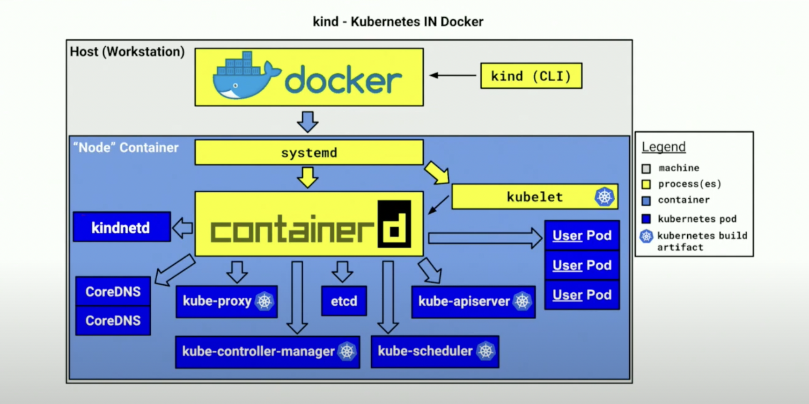

# 핸즈온. 쿠버네티스 환경 구성(local) - Kind

**Kind 환경 구성 및 애플리케이션 배포 실습**

이번 실습은 Local 환경에서 Kind로 쿠버네티스 실습 환경을 만들고 애플리케이션을 배포 해보는 실습 입니다. 로컬 환경에서 컨테이너 서비스 배포를 위한 기본 작업들을 이해 할 수 있습니다.

## 사전 준비 사항

### Kuberctl 설치

kuberctl 설치: [관련 링크](https://kubernetes.io/docs/tasks/tools/)

### Docker Desktop 설치

Docker Desktop 설치: [관련 링크](https://docs.docker.com/desktop/)

!!! tip
    윈도우를 사용하는 경우는 `WSL` 기능을 활성화 하여 리눅스 워크스페이스에서 도커를 사용 하는 것을 추천 한다.

    [WSL 설치 가이드](https://docs.microsoft.com/ko-kr/windows/wsl/install)
    

## Architecture

Kind(`K`ubernetes `IN` `D`ocker)는 쿠버네티스 클러스터의 기능들을 테스트할 수 있도록 컨트롤러, 워커 노드의 컴포넌트들을 패키징 및 Image화 한 도커 컨테이너이다.

참고: [Kind Document - Initial design](https://kind.sigs.k8s.io/docs/design/initial/), [Deep Dive: Kind - CNCF19](https://youtu.be/tT-GiZAr6eQ?t=133)

## 1. Kind 구성 하기

### 설치

[Kind Document - Installation](https://kind.sigs.k8s.io/docs/user/quick-start/#installation)

OS 패키지 매니저 혹은 바이너리를 통해서 설치를 진행

### Cluster 설정

Kind Cluster의 구성 정보를 코드화하여 관리할 수 있으며 여러 가지 기능들을 활성화할 수 있다. 원활한 실습을 위해 local cluster를 아래와 같이 컨트롤러 1개, 워커노드 3개로 클러스터를 구성하며 외부에서 ingress로 접근할 수 있도록 port mapping까지 기능을 활성화한다.

!!! INFO
    Worker node에도 ingress를 위한 HostPort Mapping을 할 수 있지만 실습에서 다른 워크로드에 의해 80, 443이 점유되고 있을 수 있기 떄문에 아래와 같이 `control node`만 활성화한다

[kind-cluster-config.yaml](../snippets/kind-cluster-config.yaml)
```yaml
kind: Cluster
apiVersion: kind.x-k8s.io/v1alpha4
# 1 control plane node and 3 workers
nodes:
# the control plane node config
- role: control-plane
  # create cluster with extraPortMappings
  # https://kind.sigs.k8s.io/docs/user/ingress/#create-cluster
  kubeadmConfigPatches:
  - |
    kind: InitConfiguration
    nodeRegistration:
      kubeletExtraArgs:
        node-labels: "ingress-ready=true"
  extraPortMappings:
  - containerPort: 80
    hostPort: 80
    protocol: TCP
  - containerPort: 443
    hostPort: 443
    protocol: TCP
- role: worker
- role: worker
- role: worker
```

참고: [configuring your kind cluster](https://kind.sigs.k8s.io/docs/user/quick-start/#configuring-your-kind-cluster), [kind example config file](https://raw.githubusercontent.com/kubernetes-sigs/kind/main/site/content/docs/user/kind-example-config.yaml)

### Cluster 생성

정의한 구성 정보(kind-cluster-config.yaml) 대로 cluster 생성
```
$ kind create cluster --config kind-cluster-config.yaml
```

### Kind Cluster 접속 확인

정상적인 output
```
Creating cluster "kind" ...
 ✓ Ensuring node image (kindest/node:v1.24.0) 🖼
 ✓ Preparing nodes 📦 📦 📦 📦
 ✓ Writing configuration 📜
 ✓ Starting control-plane 🕹️
 ✓ Installing CNI 🔌
 ✓ Installing StorageClass 💾
 ✓ Joining worker nodes 🚜
Set kubectl context to "kind-kind"
You can now use your cluster with:

kubectl cluster-info --context kind-kind
...
```

kubectl을 통해 추가된 node 확인
```
$ kubectl get nodes
NAME                 STATUS   ROLES           AGE     VERSION
kind-control-plane   Ready    control-plane   10m     v1.24.0
kind-worker          Ready    <none>          10m     v1.24.0
kind-worker2         Ready    <none>          10m     v1.24.0
kind-worker3         Ready    <none>          10m     v1.24.0
```

## 2. 애플리케이션 배포

### Nginx 워크로드 배포

대표적인 Stateless 애플리케이션인 Nginx를 쿠버네티스 환경에 배포하고 서비스 및 인그레스까지 연동하여 접근 확인을 해 본다.

!!! INFO
    Service, Ingress는 기초적인 설정으로 진행, 추후 별도 실습에서 자세히 다룰 예정

[frontend-nginx.yaml](../snippets/frontend-nginx.yaml)
```yaml
kind: Pod
apiVersion: v1
metadata:
  name: frontend
  labels:
    app: nginx
spec:
  containers:
  - image: nginx
    name: nginx
    ports:
    - containerPort: 80
---
kind: Service
apiVersion: v1
metadata:
  name: frontend-service
spec:
  selector:
    app: nginx
  ports:
  - port: 80
---
apiVersion: networking.k8s.io/v1
kind: Ingress
metadata:
  name: frontend-ingress
spec:
  rules:
  - http:
      paths:
      - pathType: Prefix
        path: /
        backend:
          service:
            name: frontend-service
            port:
              number: 80
---
```

정의된 구성대로 워크로드를 배포:
```bash
kubectl apply -f frontend-nginx.yaml
```

배포가 정상적으로 완료가 되면 Pod 정보를 찾을수 있다
```bash
kubectl get pods -l app=nginx
```

### 접근 확인

아직 Load Balancer나 Ingress Controller를 구성하지 않았기 때문에 Port-Forwarding을 통해서 직접 포트를 열어서 접근하여 접속이 잘 되는지를 확인해야 한다.

#### Port-Forwarding을 통한 접근 확인

frontend-service 서비스가 정상적으로 만들어 졌는지 확인 후
```bash
kubectl get service/frontend-service

NAME               TYPE        CLUSTER-IP   EXTERNAL-IP   PORT(S)   AGE
frontend-service   ClusterIP   10.96.1.81   <none>        80/TCP    10m
```

Port-Forwarding 설정을 통해서 local 환경에서 쿠버네티스 서비스 포트로 직접 연결을 시도

```bash
kubectl port-forward service/frontend-service 8080:80

Forwarding from 127.0.0.1:8080 -> 80
Forwarding from [::1]:8080 -> 80
```

!!! tip
    로컬환경에서 80포트가 다른 프로세스에서 이미 사용 중일 수 있으며 포트 오픈 권한이 필요할 수 있기 때문에 8080포트로 진행

Endpoint [localhost:8080](http://localhost:8080) 접근 확인 및 브라우져로 기본 nginx 페이지가 정상적으로 보이는지 확인


#### (옵션) Ingress-nginx를 구성 및 접근 확인

매번 포트포워딩으로 접근 확인을 하는 것이 매우 번거롭기 때문에 외부의 트레픽을 서비스로 포워딩 시키기 위해 Ingress-Nginx를 구성한다. (2. Fundamentals 핸즈온에서 ingress-nginx에 대해 자세히 다룰 예정)

ingress-nginx 설치 진행
```bash
kubectl apply -f https://raw.githubusercontent.com/kubernetes/ingress-nginx/main/deploy/static/provider/kind/deploy.yaml
```

ingress-nginx controller가 정상적으로 기동하고 있는지 확인
```bash
kubectl get pods -n ingress-nginx -l app.kubernetes.io/component=controller

NAME                                        READY   STATUS    RESTARTS   AGE
ingress-nginx-controller-5458c46d7d-qjscg   1/1     Running   0          2m
```

위 frontend-nginx.yaml에서 service 타입을 기본 ClusterIP로 두고 외부 노출을 Ingress를 통해 하였으므로 다음과 같이 Endpoint를 Ingress 레벨에서 확인 가능
```bash
kubectl get ingress

NAME               CLASS    HOSTS   ADDRESS     PORTS   AGE
frontend-ingress   <none>   *       localhost   80      68s
```

Endpoint [localhost:80](http://localhost:80) 접근 확인 및 브라우져로 기본 nginx 페이지가 정상적으로 보이는지 확인

## Clean Up
실습 완료 후 kind cluster 삭제
```
kind delete cluster
```
