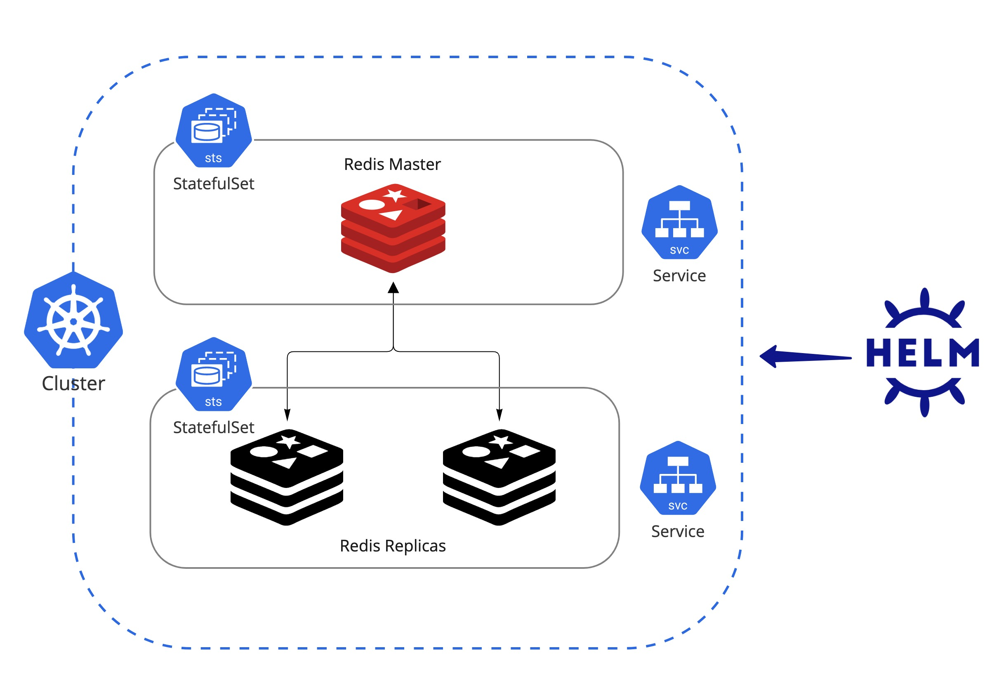

# 핸즈온. Helm으로 Redis master-replica cluster 환경 구성 및 배포

**Kind 환경 구성 및 애플리케이션 배포 실습**

이번 실습은 redis 애플리케이션을 Helm을 통해 master-replica cluster 구성으로 배포 해보는 실습 이다. Helm으로 애플리케이션 배포를 위한 기본 작업들을 이해 할 수 있다.

## 사전 준비 사항

### Kind 환경

로컬 Kind 클러스터 구성: [관련 링크](./setup-local-k8s-kind.md)

## Architecture


## 1. Helm으로 Redis M-S Cluster 환경 구성 및 배포

대표적인 cache 애플리케이션인 Redis를 쿠버네티스 환경에 helm으로 손쉽게 Master-Replica 구성 배포를 해 본다. Redis 컨테이너 이미지는 Redis에서 공식 지원하기 때문에 Standalone 환경 구성은 간단히 배포할 수 있으나 Cluster 구성을 해야 할 경우 리소스의 연관관계와 클러스터의 설정값들을 맞혀서 추가해 주어야 한다. Bitnami에서 이러한 구성 정보를 helm으로 템플릿 및 패키징화 해 놓았으며 사용자는 원하는 구성 변숫값만 수정하면 Master Replica 구성부터 Sentinel 구성까지 손쉽게 배포할 수 있다.

### 1.1 Helm Repo 추가

Bitnami helm repo를 추가

```bash
helm repo add bitnami https://charts.bitnami.com/bitnami
```

### 1.2 Redis 구성 환경 설정

두 번째로 helm [vaules 값](https://github.com/bitnami/charts/blob/master/bitnami/redis/values.yaml) 원하는 구성(Master와 Replica Cluster)에 맞게 변숫값을 업데이트

현재 기본 설정 값이 [Replication](https://github.com/bitnami/charts/blob/master/bitnami/redis/values.yaml#L105) 이므로 architecture에 대해서는 수정 하지 않아도 되며 실습 환경에 맞게 Storage Class 이름과 크기만 조절 하도록 한다.

!!! TIP
    로컬 Kind 클러스터인 경우는 `standard`가 기본 storageClass 이므로 추가할 필요 없다.
    자세한 정보에 대해 알고 싶다면 `kubectl get storageclasses.storage.k8s.io` 을 통해서 확인 가능하다.

[redis-values.yaml](../snippets/redis-values.yaml)
```yaml
global:
  storageClass: "standard"
master:
  persistence:
    size: 50Mi
replica:
  persistence:
    size: 50Mi
```

### 1.3 설치

해당 구성 정보에 맞춰서 redis cluster 배포

```bash
helm install redis-cluster bitnami/redis --namespace redis \
  --create-namespace -f redis-values.yaml
```

만약 values 값을 업데이트한 후 다시 릴리즈해야 하는 경우는 upgrade 명령어를 통해 적용할 수 있다

```bash
helm upgrade --install redis-cluster bitnami/redis \
  --namespace redis --create-namespace -f redis-values.yaml
```

다음과 같이 revision이 올라간 것을 확인 할 수 있다.
```bash
NAMESPACE: redis
STATUS: deployed
REVISION: 2
TEST SUITE: None
```

## 2. Redis M-S Cluster 환경 구성 확인

### 2.1 구성 확인

배포가 정상적으로 완료가 되면 Pod 정보를 찾을 수 있으며 다음과 같이 임시 redis client pod를 통해 redis에 접근 및 설정값을 확인할 수 있다.

```bash
# Redis Password 확인
export REDIS_PASSWORD=$(kubectl get secret --namespace redis redis-cluster -o jsonpath="{.data.redis-password}" | base64 -d)

# 테스트용 redis-client pod 생성
kubectl run --namespace redis redis-client --restart='Never'  --env REDIS_PASSWORD=$REDIS_PASSWORD  --image docker.io/bitnami/redis:7.0.3-debian-11-r0 --command -- sleep infinity

# 테스트용 redis-client pod에 접근
kubectl exec --tty -i redis-client \
--namespace redis -- bash
```

배포된 Redis 서버에 접속
```bash
# Redis 서버(master 혹은 replicas)에 접속
REDISCLI_AUTH="$REDIS_PASSWORD" redis-cli -h redis-cluster-master
REDISCLI_AUTH="$REDIS_PASSWORD" redis-cli -h redis-cluster-replicas

# 예상 output
redis-client:/$ REDISCLI_AUTH="$REDIS_PASSWORD" redis-cli -h redis-cluster-master
redis-cluster-master:6379>
redis-cluster-master:6379>
redis-cluster-master:6379> INFO
## Server
redis_version:7.0.3
redis_git_sha1:00000000
...
## Replication
role:master
connected_slaves:3
slave0:ip=redis-cluster-replicas-1.,port=6379,state=online,offset=574,lag=1
slave1:ip=redis-cluster-replicas-2.,port=6379,state=online,offset=574,lag=1
slave2:ip=redis-cluster-replicas-0.,port=6379,state=online,offset=574,lag=0
master_failover_state:no-failover
...
```

위의 output에 현재 접근한 서버는 master이고 slave가 3대가 구성된 것으로 나오며 실제로 pod 이름과 동일하게 매칭되는 것을 확인할 수 있다.

```bash
kubectl get pods -n redis -l app.kubernetes.io/component=replica
NAME                       READY   STATUS    RESTARTS   AGE
redis-cluster-replicas-0   1/1     Running   0          13m
redis-cluster-replicas-1   1/1     Running   0          14m
redis-cluster-replicas-2   1/1     Running   0          15m
```

### 2.1 Key/Value 추가 및 조회 확인

간단히 key/value를 추가(master에서만 가능)하고 조회(master/replica 둘 다 가능) 할 수 있다

```bash
redis-cluster-master:6379> SET mykey test
OK
redis-cluster-master:6379>
redis-cluster-master:6379> KEYS *
1) "mykey"
redis-cluster-master:6379>
redis-cluster-master:6379> GET mykey
"test"
redis-cluster-master:6379>
```

정상적으로 data가 replication 되고 있는지 보고 싶은 경우는 Replica 서버에 들어가서 `GET mykey`를 통해 똑같은 값이 나오는지 확인 할 수 있다.

```bash
redis-client:/$ REDISCLI_AUTH="$REDIS_PASSWORD" redis-cli -h redis-cluster-replicas
redis-cluster-replicas:6379>
redis-cluster-replicas:6379> KEYS *
1) "mykey"
redis-cluster-replicas:6379> GET mykey
"test"
redis-cluster-replicas:6379>
```

## Clean Up

실습 완료 후 Redis [Helm Release 제거](https://helm.sh/docs/helm/helm_uninstall/)
```
helm uninstall redis-cluster -n redis
```

kind cluster 삭제
```
kind delete cluster
```
