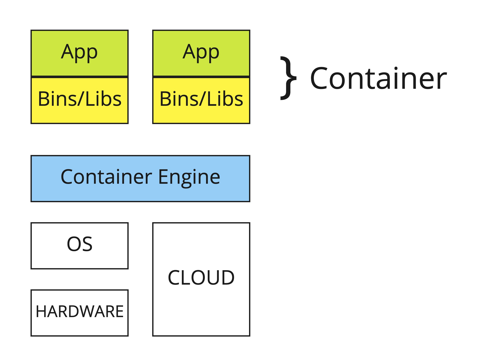

# 1.1 Container 이해

쿠버네티스를 효과적으로 사용하기 위해서는 컨테이너 기술을 이해하는 것이 필요하다.

## Container 란?

컨테이너는 OS의 커널 위에서 cgroup, namespace, netfilter등과 같은 커널 기능들을 통해 프로세스를 cpu, memory, networking, filesystem의 특정 영역에 격리 시켜 다른 공유 영역의 접근을 제한하고 독립적인 공간을 제공 하는 기술이다. 독립된 공간에 애플리케이션과 애플리케이션의 구동에 필요한 바이너리 및 라이브러리를 [Docker](https://docs.docker.com/get-started/02_our_app/#build-the-apps-container-image)나 [Podman](https://access.redhat.com/documentation/en-us/red_hat_enterprise_linux_atomic_host/7/html/managing_containers/finding_running_and_building_containers_with_podman_skopeo_and_buildah#building_container_images_with_buildah)을 통해서 OCI(Open Container Initiative) 표준에 맞게 이미지화 할 수 있으며 컨테이너 엔진 위에 배포, 관리 가능하다.

요약하자면 컨테이너는

* 격리되어 있으며 자체 소프트웨어, 바이너리 및 구성을 실행하는 프로세스
* 로컬 환경, 가상 머신, 클라우드에 국한되지 않고 자유롭게 구성 가능
* OS에 종속적이지 않으며 컨테이너 엔진만 있다면 어디든 배포, 관리 가능

## 추천 자료

* 컨테이너, Containerd, Containerd-shim, RUNC:
    * [도커는 무엇으로 어떻게 구성되어 있을까](https://medium.com/@cloudacode/%EB%8F%84%EC%BB%A4%EB%8A%94-%EB%AC%B4%EC%97%87%EC%9C%BC%EB%A1%9C-%EC%96%B4%EB%96%BB%EA%B2%8C-%EA%B5%AC%EC%84%B1%EB%90%98%EC%96%B4-%EC%9E%88%EC%9D%84%EA%B9%8C-1b2a52ca8d1c)
* Introduction to Containers, VMs and Docker:
	* [A Beginner-Friendly Introduction to Containers, VMs and Docker](https://medium.freecodecamp.org/a-beginner-friendly-introduction-to-containers-vms-and-docker-79a9e3e119b)
* Docker Overview
    * [Official Docker document: Get Started](https://docs.docker.com/get-started)