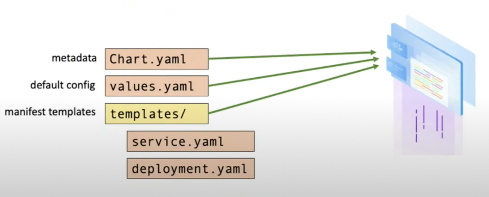

# 1.3 Helm의 이해

헬름은 복잡한 쿠버네티스 애플리케이션을 효과적으로 배포 및 운영을 할 수 있도록 해주는 패키지 관리 도구이다.

## 왜 Helm이 필요한가?

쿠버네티스에 애플리케이션을 배포하고자 할 때 애플리케이션의 구성 정보를 담고 있는 yaml 형태의 manifest 파일을 작성하게 된다. 만약 애플리케이션의 구성 정보 혹은 연관 관계가 복잡하지 않는다면 하나의 manifest 파일로 충분히 관리가 가능하지만 그렇지 않는 경우 혹은 중복되는 설정 값이 많아 변수 처리를 해야하는 경우에는 별도의 패키지 관리 도구를 사용하여 간소화 하는 것이 효과적인 방법이다. 대표적으로 [Helm](https://helm.sh/)과 [Kustomize](https://kustomize.io/)가 있으며 Helm은 애플리케이션 구성 정보를 템플릿화 하고 패키징화를 한다는 측면에서 보다 사용자 친화적이라고 말할수 있으며 Kustomize는 구성 정보 파일을 공통된 부분과 다른 부분을 폴더 레벨로 환경에 맞춰서 오버레이하게 관리가 가능하다는 장점이 있다. Helm이 3rd party 도구이긴 하지만 yum, apt, brew처럼 [패키지 생태계](https://artifacthub.io/packages/search?kind=0)가 구성되어 있으며 대부분의 애플리케이션 개발사들이 Helm Chart를 공식적으로 관리하고 있기 때문에 Kustomize 보다는 접근성과 편리함 측면에서 뛰어나다. 또한 Kustomize에서 Helm을 지원하기 때문에 애플리케이션을 템플릿화하면서 여러 환경에 각기 다른 변수들로 구성을 하는 것을 코드화 및 간소화하고 싶다고 하면 두 도구를 상호보완적으로 사용하는 것도 가능하다.

!!! INFO 
    헬름 버전 2.x 까지는 tiller라는 하나의 중앙화된 helm 작업 관리자가 존재 하였으나 권한 관리에 대한 어려움와 보안 취약점으로 인해 헬름 3.x에서는 tiller가 사라지고 쿠버네티스 API 서버에서 정보를 가져오는 방식으로 개선이 되었다 

출처: [Intro to Helm](https://www.youtube.com/watch?v=Zzwq9FmZdsU)

요약하자면 헬름은

* 쿠버네티스 애플리케이션의 패키지 관리 도구
* 템플릿화를 통해서 구성 정보를 간결하게 관리
* 패키지 repo를 통해 손쉽고 간단하게 애플리케이션을 설치 및 업그레이드 

## Helm Chart 활용법

Helm의 패키징 포맷을 Chart라고 불리며 Kubernetes 리소스가 정의된 파일의 묶음 패키지이다. 단일 차트를 사용하여 단순한 HTTP 서버부터 데이터베이스, 캐시 등이 포함된 전체 웹앱 스택과 같은 복잡한 것까지 손쉽게 배포할 수 있다. 

Chart는 크게 메타데이터를 가지고 있는 Chart.yaml, 변수값 묶음의 values.yaml 그리고 template 디렉토리에 쿠버네티스 리소스의 manifest 파일을 담고 있다. 기존에 만들어진 Chart를 통해 배포를 하는 경우는 타겟 환경에 맞게 values.yaml의 값들만 수정을 하면 된다. 예를 들어 mysql의 설치 및 구성을 helm으로 진행한다고 가정하면 먼저 [artifact hub](https://artifacthub.io/packages/search?ts_query_web=mysql&sort=relevance&page=1) 혹은 애플리케이션 공식 github repo에서 helm chart를 검색하고 해당 repo를 추가한 후 values.yaml 파일을 검토 및 필요에 따라 수정을 한 후 설치를 진행하면 된다.

!!! INFO
    개발사에서 공식적으로 Helm Chart를 지원하지 않고 bitnami와 같은 별도의 3rd party 밴더가 Chart를 메인터넌스 하는 경우도 많다. 이때 GitHub Star 개수나 얼마나 적극적으로 컨트리뷰션이 이루어지고 있는지를 보고 판단하는 것을 추천한다. 

## 추천 자료

* Helm Overview
    * [Official Helm Docs](https://helm.sh/docs/)

* Helm으로 Wordpress 구성
    * [Digitalocean: How to set up wordpress with mysql on kubernetes using helm](https://www.digitalocean.com/community/tutorials/how-to-set-up-wordpress-with-mysql-on-kubernetes-using-helm)

* Kustomize로 Workpress 구성
    * [Mirantis: Creating a kubernetes app out of multiple pieces](https://www.mirantis.com/blog/introduction-to-kustomize-part-1-creating-a-kubernetes-app-out-of-multiple-pieces/)

* Kustomize + Helm 활용
    * [JFrog: Power up helm charts using kustomize to manage kubernetes deployments](https://jfrog.com/blog/power-up-helm-charts-using-kustomize-to-manage-kubernetes-deployments/)

* Terraform Helm Provider
    * [Helm Provider](https://registry.terraform.io/providers/hashicorp/helm/latest/docs)