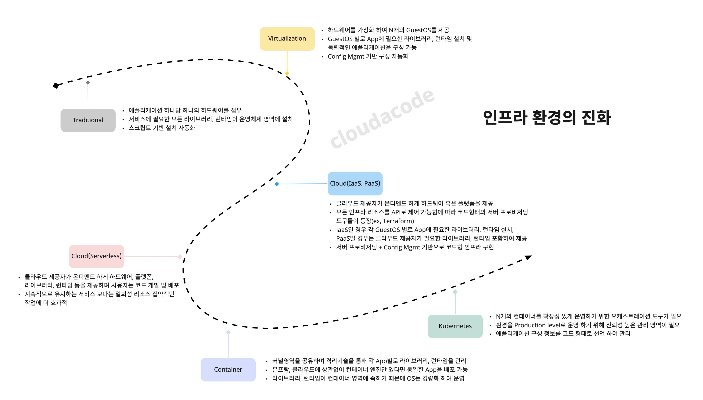
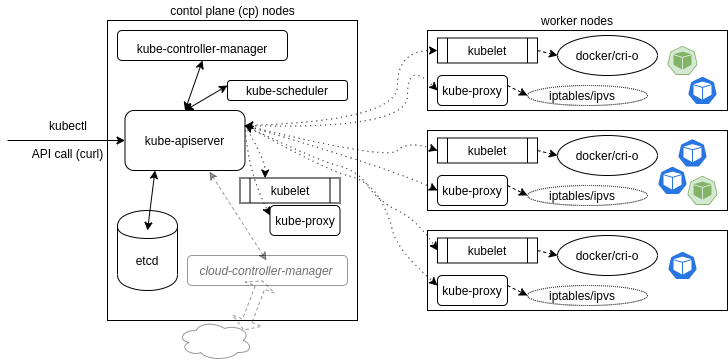

# 1.2 Kubernetes 이해

## Kubernetes 란?

쿠버네티스란 컨테이너화된 애플리케이션을 자동으로 배포, 확장, 관리해주는 오픈소스 시스템이다.

!!! INFO
    an open-source system for automating deployment, scaling, and management of containerized applications.
    [kuberentes.io](https://kubernetes.io/)

## Kubernetes 등장 배경

쿠버네티스는 전 세계적으로 가장 대표적인 컨테이너 오케스트레이션 도구이며 오랫동안 구글 내부적으로 사용하던 컨테이너 클러스터 관리 시스템([Borg](https://research.google/pubs/pub43438/))으로부터 출발하여 2013년도부터 쿠버네티스라는 이름으로 오픈소스 프로젝트로 진행이 되고 있다. 여러가지 등장 배경이 있지만 가장 큰 이유는 어플리케이션의 진화와 인프라스트럭처의 진화라고 볼 수 있다. 

클라우드 컴퓨팅과 도커를 필두로 [컨테이너 기술](./what-is-container.md)의 비약적인 발전에 따라 마이크로 서비스된 형태로 개발된 애플리케이션들을 쉽게 리소스들을 격리하고 확장성을 높일 수 있게 되었으며 또한 비즈니스 요구사항에 맞춰서 빠르게 기능들을 개발하고 배포를 신속하고 유연하게 할 수 있게 되었다.

| 과거      | 현재                          |
| ----------- | ------------------------------------ |
| Monolithic  | Microservices 들로 작게 나누고 Decoupled(낮은 응집도) |
| 하나의 Release Cycle | 서비스 컴포넌트 별로 Release Cycle |
| 고정적인 애플리케이션 서버 집합  | 클러스터 단위로 확장성 있게 운영 |

하지만 분산된 구조의 대규모 확장성있는 환경을 운영하는 것은 매우 어려운 일이며 다음과 같은 어려움에 직면하게 된다.

* Microservices 들이 많아짐에 따라 운영의 어려움
* 에러 발생 시 디버깅이 어려움
* east-west 통신의 tracking이 어려움
* 어플리케이션의 컨테이너화에 따라 운영의 복잡성이 높아짐
* 빌드, 배포 자동화가 필요
* 컨테이너를 관리하는 신뢰성 있는 머신 클러스터가 필요
* 유연하고 확장 가능한 네트워크, 스토리지가 필요

이러한 어려움을 극복할 수 있도록 도와주는 도구가 쿠버네티스이며 애플리케이션과 인프라스트럭처의 진화의 단계에 중심에서 다양한 기능들을 제공하고 서비스를 효과적으로 운영 관리할 수 있도록 만들어 준다.

## Kubernetes 컨셉

쿠버네티스는 마이크로서비스 혹은 하나의 큰 서버 보다는 작지만 많은 서버를 분산 배포하여 운영하는 접근 방식이다. 서버와 클라이언트의 어플리케이션이 많은 에이전트들로 요청에 따른 응답을 할 것을 예상하도록 작성 되어 있다. 한가지 중요한 부분은 클라이언트가 서버 프로세스가 죽거나, 교체되거나, 일시적인 서버의 배포로 이어지는 것을 예상 하고 있어야 한다.
또한, 커뮤니케이션은 API 호출 기반으로 유연하게 이루어진다. 구성 정보는 JSON 형태로 ETCD에 저장되어 있으며 커뮤니티에 의해 대부분 YAML로 작성된다. 쿠버네티스 에이전트는 데이터베이스에 저장되기 전에 YAML을 JSON으로 변환 시켜 저장한다.

### Control Plane
* [kube-apiserver](https://kubernetes.io/docs/reference/command-line-tools-reference/kube-apiserver/): API 서버는 REST를 통해 다른 모든 구성 요소가 상호 작용할수 있도록 제공하는 프론트엔드 영역이며 Pod, Service, replicationcontrollers 등의 API 개체에 대한 데이터의 유효성을 검사하고 적용한다.
* kube-scheduler: 할당된 노드가 없는 새로 생성된 파드를 확인하여 실행할 노드를 선택하는 관리 영역이다.
* kube-controller-manager: 컨트롤러 프로세스를 실행하는 컴포넌트이며 다음과 같은 컨트롤러를 관리 한다.
  * node controller: 노드가 다운되었을 때 대응과 notice에 관한 책임을 가진다.
  * Job controller: Job의 개체를 감시한 다음해당 작업이 완료 될때 까지 실행되는 파드를 생성 관리 한다.
  * Endpoints controller: 서비스와 파드를 연결시키는 역할을 담당 한다.
  * Service Account & Token controllers: 새로운 네임스페이스에 대한 기본 계정과 API 접근 토큰을 생성한다.
* cloud-controller-manager: 클라우드별 컨트롤 로직을 포함하는 쿠버네티스 컨트롤 플레인 컴포넌트이다. 클라우드 컨트롤러 매니저를 통해 클러스터를 클라우드 공급자의 API에 연결된다.

### Worker
* kubelet: 클러스터의 각 노드에서 실행되는 에이전트. Kubelet은 파드에서 컨테이너 관리 운영하는 주체 이다.
* [kube-proxy](https://kubernetes.io/ko/docs/reference/command-line-tools-reference/kube-proxy/): 클러스터에 정의된 서비스의 네트워크 정책을 반영하고 서비스의 Pod에 대한 요청을 포워딩 하는 규칙을 관리 한다.

## Kubernetes 장점 및 고려사항

### 장점
모든 리소스를 Code로 선언 및 관리할 수 있으며 GitOps, CICD등을 활용하여 애플리케이션 배포를 자동화할 수 있으며 On-prem 및 Cloud 환경 agnostic 하게 컨테이너를 관리 운영 가능하다는 장점이 있다.

### 고려사항
쿠버네티스의 컨셉에 맞춰 애플리케이션의 변화(Scale out 구조, Microservice 형태)가 필요하며, 다양한 방법으로 개발조직을 쿠버네티스로 on-boarding 하여 사전 검증 필요하다. 또한 인프라 관점에서 쿠버네티스의 리소스들을 고려해서 설계하고 구축을 진행해야 하며 구축 완료 후에도 효과적으로 사용하기 위해 다양한 CNCF 생태계의 쿠버네티스 컴포넌트들을 본인의 환경에 맞게 조합해야 한다. 특히 그 생태계가 매우 방대하므로 Learning Curve 꽤 높고 충분한 시간과 테스트를 거친 후에 프러덕션 워크로드를 배포해야 한다.

## 추천 자료

* Kubernetes Tutorials Overview
    * [Official Kubernetes Tutorials](https://kubernetes.io/docs/tutorials/)