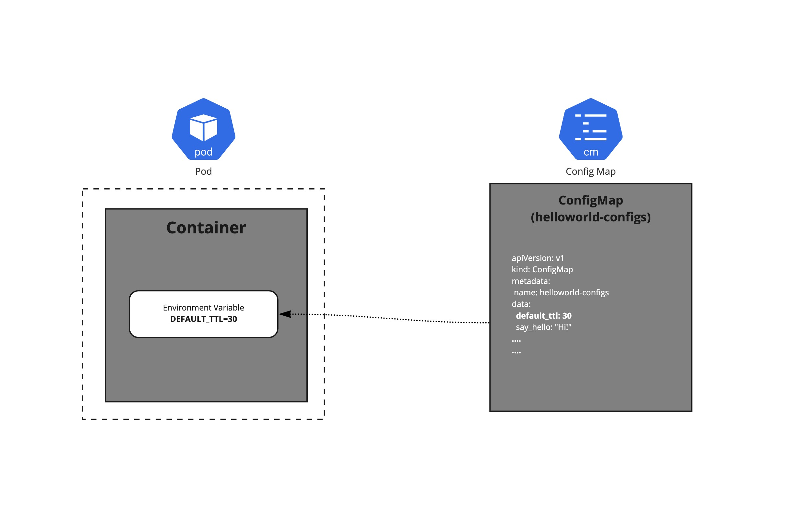
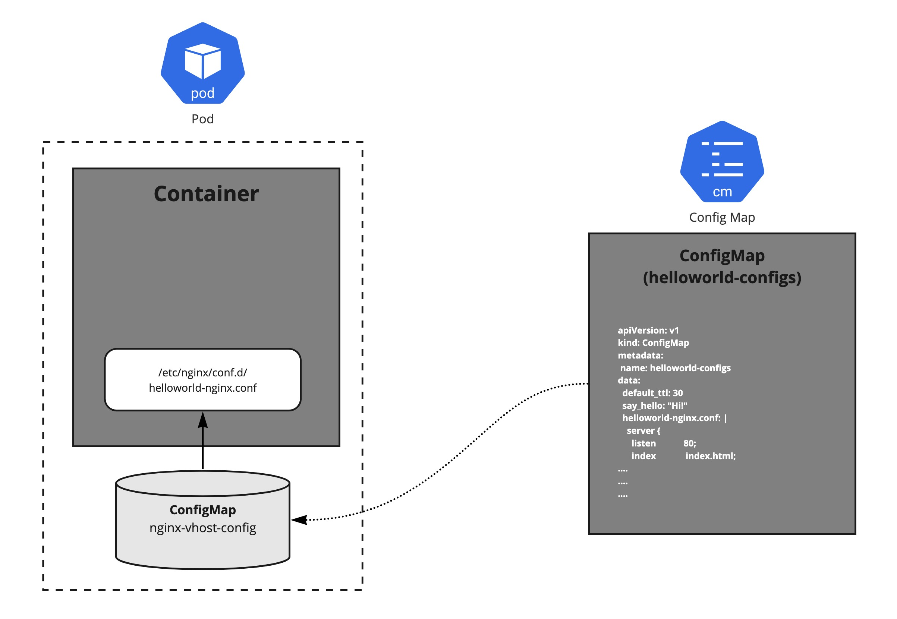
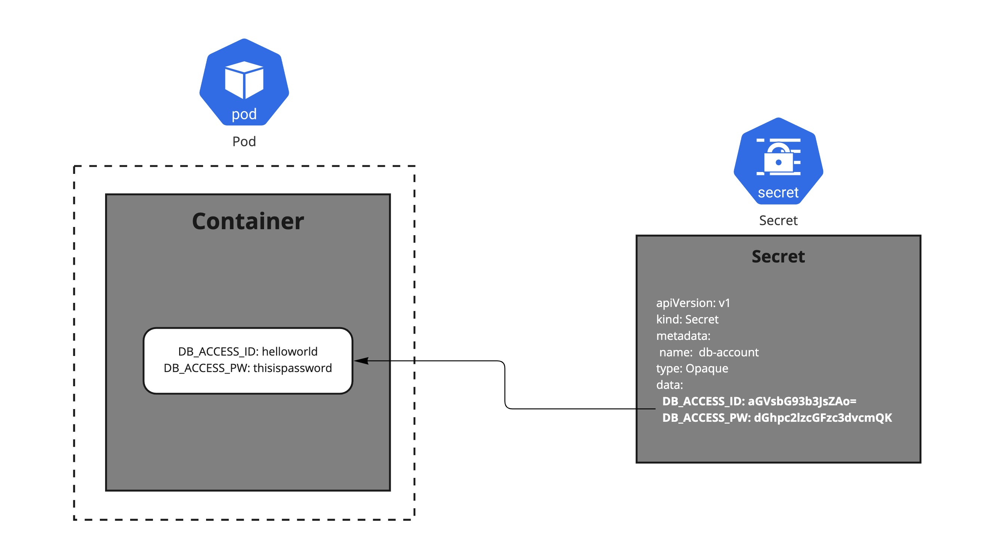

# 2.6 ConfigMaps & Secrets

어플리케이션을 개발할 때, 환경별(개발환경, 테스트환경, 운영환경 등)로 설정 정보를 다르게 만들어 다루는 것은 일반적이다. 예를 들어, 테스트 환경의 경우 테스트 환경에서만 사용하는 데이터베이스를 접근하기 위한 endpoint 정보가 있을 것이다. 어플리케이션이 이런 환경 정보를 직접 가지고 있을 수도 있겠지만, 쿠버네티스에서는 ConfigMap 과 Secret 이라는 오브젝트를 활용하여 어플리케이션의 코드와 설정 정보를 분리하여 설정에 대한 결합도를 낮출 수 있다.

## ConfigMaps

ConfigMap은 설정 정보를 하나 혹은 이상의 key/value 쌍으로 저장할 수 있으며, value는 단일 값이 될 수도 있고, 파일의 내용이 될 수도 있다.

ConfigMap manifest의 예시를 보자. 
```yaml
apiVersion: v1
kind: ConfigMap
metadata:
  name: helloworld-configs
data:
  # 아래와 같이 간단한 key/value로 정의할 수 있다. 
  default_ttl: 30
  say_hello: "Hi!"
  
  # 또는, 설정 file 내용을 value로 정의할 수도 있다.
  helloworld-nginx.conf: |
    server {
      listen            80;
      index             index.html;
      server_name       cloudacode.com;
      
      location / {
        root  /cloudacode/static/
      }
      
      location /api {
        proxy_pass  https://api.cloudacode.internal
      }
    }
```

### Pod 에 ConfigMap 정보를 전달하기
이렇게 정의된 ConfigMap은 Pod에 다양한 방법으로 전달될 수 있다.

* 환경 변수로 정의하기
* Command-line Argument 로 전달하기 
* Volume으로 만들어 파일 혹은 디렉토리로 마운트하기

#### ConfigMap의 정보를 환경변수로 정의하기
이전에 설명한 ConfigMap 예시에 있는 정보의 일부를 Pod를 생성할 때 환경 변수로 읽는 방법이다.



```yaml
apiVersion: v1
kind: Pod
metadata:
  name: helloworld
spec:
  containers:
  - image: busybox
    env:
    - name: DEFAULT_TTL  # 환경변수 이름. 아래 ConfigMap key에 해당하는 value를 가진다. 
      valueFrom:
        configMapKeyRef:
          name: helloworld-configs  # ConfigMap의 이름
          key: default_ttl         # ConfigMap에 정의된 key
```

#### ConfigMap의 정보를 Command-line Argument로 전달하기
이전 환경변수로 읽어온 값을, $(VALUE_NAME) 과 같은 문법을 이용해 Command-line Argument로 전달할 수도 있다.

```yaml
apiVersion: v1
kind: Pod
metadata:
  name: helloworld
spec:
  containers:
  - image: busybox
    command: [ "/bin/sh", "-c", "echo $(WELCOME_MESSAGE)"]
    env:
    - name: WELCOME_MESSAGE 
      valueFrom:
        configMapKeyRef:
          name: helloworld-configs
          key: say_hello
```

#### ConfigMap의 정보를 파일 혹은 디렉토리로 마운트하기
이 방법은 가장 흔하게 사용할 수 있는 ConfigMap을 전달하는 방법 중 하나로, 웹서버의 설정파일 등을 파일 혹은 디렉토리 형식으로 Pod에 전달할 수 있다.



```yaml
apiVersion: apps/v1
kind: Pod
metadata:
  name: nginx
spec:
  containers:
  - name: nginx
    image: nginx
    ports:
    - containerPort: 80
    volumeMounts:
      - name: nginx-vhost-config
        mountPath: /etc/nginx/conf.d
        readOnly: true
  volumes:
    - name: nginx-vhost-config
      configMap:
        name: helloworld-configs
        items:
        - key: "helloworld-nginx.conf"
          path: "helloworld-nginx.conf"
```
이렇게 선언된 Pod에서는 `/etc/nginx/conf.d/` 경로에 `helloworld-nginx.conf` 파일이 마운트되는 것을 확인할 수 있다.

### ConfigMap 의 변경 사항 반영
생성되어있는 ConfigMap의 내용을 바꾸는 경우, ConfigMap을 Volume으로 마운트해서 사용하는 Pod에도 업데이트된 설정을 읽을 수 있다. 

다만 ConfigMap의 변경된 정보를 업데이트 받는데는 아래와 같은 제약사항이 있을 수 있다.

* 업데이트는 kubelet 의 동기화 시간 혹은 캐시 지연 설정등 만큼 걸릴 수 있다.
* ConfigMap 정보를 subPath를 사용하여 volume 마운트 시 업데이트를 받지 못 한다.
* 환경변수로 읽어온 ConfigMap 정보 역시 업데이트를 받지 못 한다.

### Immutable ConfigMap 
경우에 따라 한번 생성된 ConfigMap을 내용 변경없이 생성/관리하는 방식을 선택할 수도 있다.
이 경우, `immutable` 필드를 `true` 로 설정하여 내용이 변경될 수 없는 ConfigMap을 만들 수 있다.

이렇게 생성된 ConfigMap은,
* kubelet이 감시하지 않으므로 kube apiserver의 부하를 줄일 수 있다.
* 우발적인 ConfigMap 변경이 모든 어플리케이션에 영향을 주지 않도록 할 수 있다.  

!!!INFO 
    Nginx와 같은 웹서버의 설정 파일의 경우, 설정의 내용을 변경한다고 하더라도 웹서버에 직접 명령을 통해 설정을 다시 읽도록 해야 반영이 된다. Pod로 구성된 웹서버라면 ConfigMap으로 생성된 설정 파일이 변경되었을 때, Pod를 재생성하여 설정을 반영하는것이 효율적일 수 있다. 이런 경우라면, ConfigMap의 변경을 감시하지 않는 Immutable ConfigMap 으로 만들어 관리해볼 수 있다.

### ConfigMap 의 제약사항
* ConfigMap의 크기는 1MiB 로 제한된다. 

## Secrets

Secret은 패스워드, API token 등과 같은 유출에 민감한 정보를 저장하기 위한 목적으로 설계되어있다.
Application 에서 코드에 직접 민감한 정보를 저장하지 않고, Secret을 사용하여 Pod가 생성되는 시점에 전달할 수 있다.

!!! warning  
    Secret 리소스의 기본 저장은 etcd에 암호화하지 않은 상태로 저장한다.  
    Secret 리소스를 암호화하여 저장하려면 저장 시 암호화(Encryption at rest)를 활성화하고, Encryption Provider 를 활용해서 데이터에 대해 암호화를 구성해야 한다.

Secret은 `data` 혹은 `stringData` 필드에 데이터를 저장할 수 있다.  
`data`로 저장하는 경우, key/value 중 value를 `base64`로 인코딩 해야 한다.

### Secret 타입

| Built-in Type                       | Usage                            |
|-------------------------------------|----------------------------------|
| Opaque                              | 임의이 사용자 지정 데이터                   |
| kubernetes.io/service-account-token | Service Account 토큰               |
| kubernetes.io/dockercfg             | 직렬화된 `./dockercfg` 파일            |
| kubernetes.io/dockerconfigjson      | 직렬화된 `./docker/config.json` 파일   |
| kubernetes.io/basic-auth            | Basic Authentication 용 credential |
| kubernetes.io/ssh-auth              | SSH Authentication 용 credential  |
| kubernetes.io/tls                   | TLS 인증서 형태의 데이터                  |
| bootstrap.kubernetes.io/token       | 부트스트랩 토큰 데이터                     |


### Secret 사용 예시

Secret 은 아래와 같은 형식으로 정의할 수 있다.
```yaml
apiVersion: v1
kind: Secret
metadata:
  name: db-account
type: Opaque
data:
  DB_ACCESS_ID: aGVsbG93b3JsZAo=
  DB_ACCESS_PW: dGhpc2lzcGFzc3dvcmQK
```

Pod에서 위에 정의된 Secret 을 사용하려면 아래와 같이 사용이 가능하다. 
Secret을 `envFrom` 구절을 이용해 Pod의 생성 시점에 Environment Variable로 저장할 수 있다.




```yaml
apiVersion: v1
kind: Pod
metadata:
  name: secret-test-pod
spec:
  containers:
    - name: test
      image: k8s.gcr.io/busybox
      command: [ "/bin/sh", "-c", "env" ]
      envFrom:
      - secretRef:
          name: db-account
  restartPolicy: Never
```

### Secret 보호
* Kubernetes 에서는 Secret을 필요로하는 Pod가 있는 Node에만 Secret 정보가 전달되도록 설계되어있다.
* Kubelet은 Secret을 Node의 `tmpfs`(가상메모리 공간)에 저장하여 disk에 영구적으로 기록되지 않도록 한다.
* Pod에 2개 이상의 Container가 있는 경우, 명시적으로 mount 하는 container에서만 secret을 조회할 수 있다.    