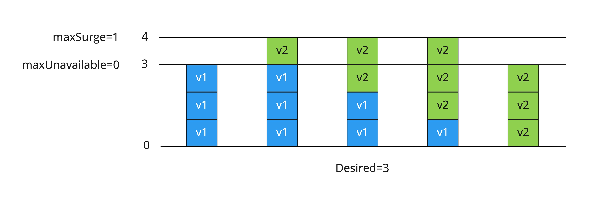
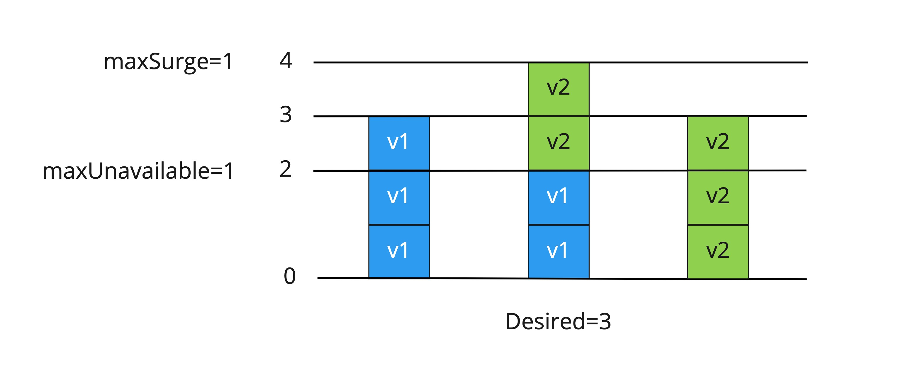

# 2.4 Deployment & ReplicaSet

Pod 리소스를 직접 명령어를 통해서 배포도 가능하지만 보다 효과적으로 리소스를 배포, 관리를 하기 위해서는 Deployment, StatefulSet와 같은 쿠버네티스 오브젝트를 활용해야 한다. Deployments에는 container image, replica 개수, spec 등등이 desired state 작성되며 controller가 리소스를 모니터링하고 배포, 스케쥴링 하면서 실제 상태를 선언된 상태와 동일하게 맞춘다. 실제 Pod들의 spec과 상태를 모니터링 하고 관리 하는 역할은 ReplicaSet이 하며 사용자는 직접 ReplicaSet을 관리 운영 할일이 없으며 Deployment를 통해 제어가 된다.

## Deployment

Deployment를 생성을 하거나 업데이트를 하면 컨트롤러는 해당되는 리소스가 현재 존재하는지 확인 후 지정된 복제본(replicas)과 실제 복제본을 일치 시키는 작업을 진행 한다. Deployment는 직접 복제본을 관리하지 않으며 대신 ReplicaSet이 복제본에 대한 관리를 수행 한다.

## ReplicaSet

ReplicaSet은 지정된 수의 Pod 여러 개를 항상 가용하게 만들어주는 역할을 하며 Label을 통해서 관리한다. 예를 들어 role=web의 label을 가지고 있는 ReplicaSet을 생성/수정/삭제하면 컨트롤러가 먼저 label이 role=web인 모든 Pod를 검색하고 해당 Pod의 [ownerReference](https://kubernetes.io/ko/docs/concepts/architecture/garbage-collection/#owners-dependents)의 종속관계를 확인 후 Pod를 제어한다.

## Deployment Strategies

새로운 버전의 컨테이너가 배포 될때 Rolling으로 신규 Pod를 배포, 기존 Pod를 삭제 하는 전략 이다. `.spec.strategy.type` 값으로 Recreate 혹은 RollingUpdate 배포 전략을 설정할 수 있으며 기본은 RollingUpdate이다.

Recreate는 새 Pod가 생성되기 전 이전 버전의 모든 Pod를 삭제하는 방식이며 RollingUpdate는 순차적으로 오래된 Pod를 삭제하고 새 Pod는 생성을 반복하여 배포하는 방식이다. RollingUpdate의 경우는 Max Unavailable과 MaxSurge 값을 지정할 수 있다.

- maxSurge: ReplicaSet의 Desired 값보다 N개 혹은 N%만큼 더 생성하여 Rollout 가능한 범위의 설정값 (기본값 25%)
- maxUnavailable: 이전 버전 Pod 삭제 시 최소 유지해야 할 개수 혹은 비율의 설정값 (기본값 25%)

예시1. desired=3 maxSurge=1 maxUnavailable=0 인 경우

예시2. desired=3 maxSurge=1 maxUnavailable=1 인 경우

