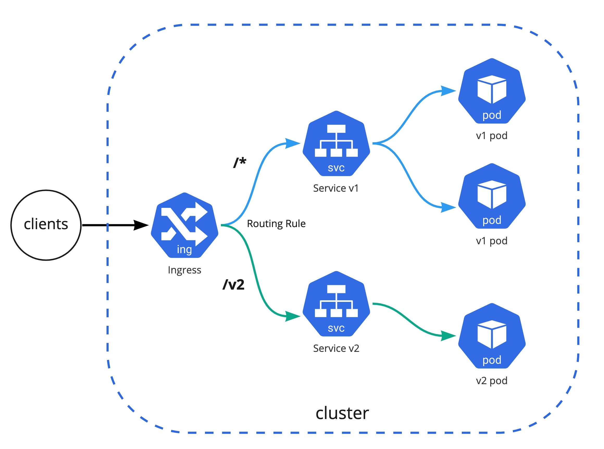

# 핸즈온 2.4 Service & Ingress

**Ingress-nginx 구성 및 Ingress를 통해 Service 접근 실습**

로컬 쿠버네티스 환경에서 ingress-nginx controller를 구성하고 Ingress를 통해 여러 개의 서비스에 어떻게 접근을 할 수 있는지 알아보는 실습

## 사전 준비 사항

Kind Kubernetes Cluster 구성: [실습 링크](../../section01/handson/setup-local-k8s-kind.md)

Helm의 이해: [관련 링크](../../section01/what-is-helm.md)

Helm 설치 및 애플리케이션 배포 방법: [실습 링크](../../section01/handson/setup-redis-via-helm.md)

## Architecture

하나의 Ingress에 여러 버전의 Backends를 구성하고 URL Path를 기준으로 트레픽을 라우팅



/v2를 제외한 모든 path(`/*`)는 첫 번째 버전의 워크로드로 전달, `/v2`만 두 번째 버전의 워크로드로 전달

## 1 Ingress Nginx 구성

쿠버네티스 자체는 클라우드에 종속적이지 않는 [애그노스틱](https://en.dict.naver.com/#/entry/enko/e36b56714ef5450c9cf82ef18efb1190)한 도구이기 때문에 다양한 Ingress Controller가 있으며 대표적으로 오픈소스 ingress 중에서는 [Ingress-Nginx](https://github.com/kubernetes/ingress-nginx/tree/main/charts/ingress-nginx)가 유명하며 [쿠버네티스 공식적으로 지원](https://kubernetes.io/docs/concepts/services-networking/ingress-controllers/)을 하는 컨트롤러 이다

### 1.1 Helm Value 설정

Helm을 통해서 설치하기 위해 기존 ingress nginx의 [helm value](https://github.com/kubernetes/ingress-nginx/blob/main/charts/ingress-nginx/values.yaml) 값을 다음과 같이 설정

[ingress-nginx-values.md](../snippets/ingress-nginx-values.yaml)
```yaml
controller:
  replicaCount: 1
  nodeSelector:
    ingress-ready: "true"
  tolerations:
  - effect: NoSchedule
    key: node-role.kubernetes.io/master
    operator: Equal
  - effect: NoSchedule
    key: node-role.kubernetes.io/control-plane
    operator: Equal
  watchIngressWithoutClass: true
  hostPort:
    enabled: true
  service:
    type: NodePort
```

!!! INFO
    로컬 Kind 클러스터는 extraPortMappings이 kind 컨테이너의 hostport 80, 443으로 매핑이 되기 때문에 hostPort로 Ingress Controller를 활성화해주어야 한다.

### 1.2 Ingress-Nginx 컴포넌트 설치

```bash
helm upgrade --install ingress-nginx ingress-nginx \
  --repo https://kubernetes.github.io/ingress-nginx \
  --namespace ingress-nginx --create-namespace -f ingress-nginx-values.yaml
```

정상적으로 배포가 완료 되었다면 IngressClass는 `nginx`로 구성이 되며 다음과 같이 확인 가능하다

```bash
kubectl get ingressclasses.networking.k8s.io

NAME    CONTROLLER             PARAMETERS   AGE
nginx   k8s.io/ingress-nginx   <none>       5m
```

## 2 데모 애플리케이션 배포

데모 Stateless 애플리케이션 v1과 v2를 demo 네임스페이스에 배포하고 서비스 및 인그레스까지 연동하여 접근 확인을 해 본다

데모용 네임스페이스 생성
```bash
kubectl create ns demo
```

### 2.1 데모앱 v1 배포

애플리케이션 `v1` 배포 및 모든 URL Path가 v1 애플리케이션으로 포워딩 되도록 Ingress 설정

```bash
kubectl create deployment demo01 \
  --image=cloudacode/hello-go-app:v1.0.0 --port=8080 -n demo

kubectl expose deployment demo01 --port=80 --target-port=8080 -n demo

kubectl create ingress demo01 --class=nginx --rule="/*=demo01:80" -n demo
```

혹은 선언형(Declarative) 예시
[ingress-service-demo-app.yaml](../snippets/ingress-service-demo-app.yaml)

!!! INFO
    위의 helm value 값에서 `watchIngressWithoutClass: true` 옵션을 주었기 때문에 따로 class 옵션을 주지 않아도 자동으로 nginx ingress를 사용하게 된다.

```bash
$ kubectl get ing
NAME     CLASS   HOSTS   ADDRESS         PORTS   AGE
demo01   nginx   *       10.96.119.252   80      112s
```

### 2.2 데모앱 v2 배포

애플리케이션 `v2` 배포 및 `/v2` URL Path가 v2 애플리케이션으로 포워딩 되도록 Ingress 설정

```bash
kubectl create deployment demo02 \
  --image=cloudacode/hello-go-app:v2.0.0 --port=8080 -n demo

kubectl expose deployment demo02 --port=80 --target-port=8080 -n demo

kubectl create ingress demo02 --class=nginx --rule="/v2=demo02:80" -n demo
```

혹은 선언형(Declarative) 예시
[ingress-service-demo-app.yaml](../snippets/ingress-service-demo-app.yaml)

!!! TIP
    만약 애플리케이션 url이 `/`로 동작하는 경우는
    `--annotation="nginx.ingress.kubernetes.io/rewrite-target=/`
    을 추가 해준다

## 3. 접근 확인

가장 먼저 애플리케이션의 워크로드가 정상적으로 기동 중인지 확인
```bash
kubectl get pods -n demo
NAME                      READY   STATUS    RESTARTS   AGE
demo01-5dff6fb4d4-b4rch   1/1     Running   0          2m
demo02-d57799f78-phs4r    1/1     Running   0          1m

kubectl get svc -n demo
NAME     TYPE        CLUSTER-IP     EXTERNAL-IP   PORT(S)   AGE
demo01   ClusterIP   10.96.144.58   <none>        80/TCP    7m
demo02   ClusterIP   10.96.69.13    <none>        80/TCP    5m
```

위에서 구성한 Ingress 설정 동작 확인:
**/v2를 제외한 모든 path는 첫 번째 demo01 워크로드로 전달되며 /v2만 demo02 워크로드로 전달**

```bash
curl 127.0.0.1
Hello, world!
Version: 1.0.0
Hostname: demo01-5dff6fb4d4-b4rch
```

```bash
curl 127.0.0.1/v2
Hello, world!
Version: 2.0.0
Hostname: demo02-d57799f78-phs4r
```

## 4 Clean Up
실습 완료 후 kind cluster 삭제
```
kind delete cluster
```
