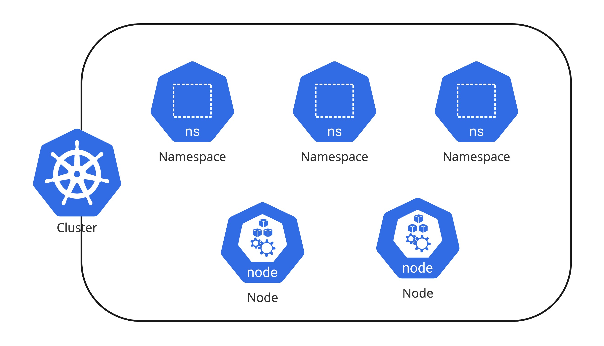

# 2.1 Pod & Namespace

## Pod

쿠버네티스에서 컨테이너는 독립적으로 관리 되지 않으며 Pod라는 하나의 리소스로 관리 된다. Pod는 하나 이상의 컨테이너로 이루어져 있으며 IP 주소, 스토리지 그리고 리눅스 네임스페이스를 공유한다. 컨테이너를 직접 사용하는 것이 아닌 Pod가 필요한 이유는 컨테이너가 하나의 main process만 띄우도록 설계가 되었기 때문에 multi processes로 운영해야 하는 애플리케이션 같은 경우는 각각 프로세스별로 컨테이너를 띄우고 그 컨테이너들의 묶음 자체를 하나의 그룹으로 관리해야 한다. 또한 위에서 언급한 것처럼 네트워크, 스토리지 볼륨과 같은 내부 리소스들이 공유되기 떄문에 보안과 성능에 대한 이득도 갖는다.


!!!INFO 
    기본으로는 컨테이너들끼리는 PID 접근이 안 되지만 추가로 Pod 스펙에 `shareProcessNamespace` 옵션을 사용하면 다른 컨테이너의 PID도 접근할 수 있다.
    https://kubernetes.io/docs/tasks/configure-pod-container/share-process-namespace/

파드의 [lifecycle](https://kubernetes.io/docs/concepts/workloads/pods/pod-lifecycle/)은 Pending, Running, Succeed, Failed, Unknown, CrashLoopBackOff로 분류 된다.


| Lifecycle      | Description                          |
| ----------- | ------------------------------------ |
| Pending  | 클러스터에서 Pod의 생성이 허락되었지만 하나 이상의 컨테이너가 준비되지 않았다는 상태이며 Schedule 되는 시간과 컨테이너 이미지를 다운로드하는 시간 중에도 Pending |
| Running | Pod가 워커노드에 바인딩되었으며 모든 컨테이너가 생성된 상태 |
| Succeed  | Pod의 모든 컨테이너가 성공적으로 종료된 상태와 Job이 성공적으로 종료된 상태 |
| Failed  | 하나 이상의 컨테이너가 실패하여 종료 되었으며 모든 컨테이너가 종료된 상태 |
| Unknown  | 어떤 이유로 컨테이너 상태가 확인되지 않고 노드에서 Pod의 상태 확인을 위한 접속이 되지 않는 상태 |
| CrashLoopBackOff  | 컨테이너 시작이 지속해서 실패하고 있으며 일반적으로 이미지의 문제가 있거나 환경 변수 설정 등의 이슈로 컨테이너가 정상적으로 시작되지 않는 상태 |

## Namespace

하나의 쿠버네티스 클러스터에 하나의 서비스 혹은 하나의 팀이 사용하는 경우보다는 멀티 테넌트 하게(여러 서비스가 혼재되어) 다양한 팀 혹은 사용자들이 리소스를 공유하여 클러스터를 사용하는 사례가 매우 일반적이다. 서비스 혹은 팀 간에 독립된 공간을 할당할 필요가 있으며 이때 Namespace를 통해서 서비스별 리소스를 논리적으로 나누고 관리 할 수 있다. 하지만 실제 Pod가 생성되는 Worker node는 공유가 되는 영역이기 때문에 self-service 된 형태로 리소스를 생성하고 관리를 한다고 하면 각 namespace 별로 quota를 부여하여 사용하는 리소스를 soft/hard limit으로 관리 하고 사용자 접근에 대해 [RBAC(Role Based Access Controller)](https://kubernetes.io/docs/reference/access-authn-authz/rbac/)로 관리하는 것이 추후 리소스 관리의 측면에서보다 효과적이다. 또한 namespace에도 label이 가능하므로 label을 통해 그룹화 가능하다.



```bash
$ kubectl create namespace demo
namespace/demo created

$ cat <<EOF > compute-resources.yaml
apiVersion: v1
kind: ResourceQuota
metadata:
  name: compute-resources
spec:
  hard:
    requests.cpu: "1"
    requests.memory: 1Gi
    limits.cpu: "2"
    limits.memory: 2Gi
EOF

$ kubectl create -f ./compute-resources.yaml --namespace=demo

$ kubectl get quota --namespace=demo
NAME                AGE   REQUEST                                     LIMIT
compute-resources   35s   requests.cpu: 0/1, requests.memory: 0/1Gi   limits.cpu: 0/2, limits.memory: 0/2Gi

$  kubectl label namespace demo env=dev
namespace/test labeled

$ kubectl get namespace -l env=dev
NAME   STATUS   AGE
demo   Active   12m
```