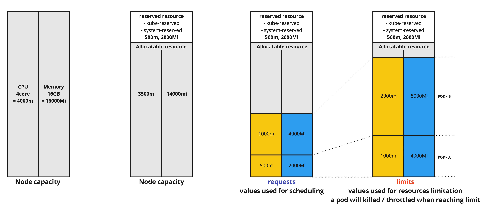

# Resources
쿠버네티스에서 사용자 application의 Pod을 정의할때, container가 사용하는 resource 양을 지정할수 있다. 대표적인 사전 정의된 resource는 cpu, memory가 있다. 그리고 이 resource는 pod(혹은 container)에 의해 요청/할당/소비가 가능하다.

지정할수 있는 resource는 type을 가지고 type name(e.g cpu, memory)을 가지고 구분할수 있다. 여기서는 쿠버네티스에서 사전에 정의된 compute resource인 cpu, memory를 다룬다. resource type에는 측정 가능한 수량 및 단위가 있다.

## Resources specifications
### kubernetes에서 사전 정의된 resources
```bash
spec.containers[].resources.limits.cpu
spec.containers[].resources.limits.memory
spec.containers[].resources.requests.cpu
spec.containers[].resources.requests.memory
```

!!! INFO
    이 외에도 사전 정의된 resources는 ephemeral-storage , hugepages-`<hugepagesize`> 이 있다.

pod에서 container가 필요한 resource를 requests에 명시하면 지정된 리소스를 가지고 [kube-scheduler가 pod가 실행될 노드를 선택](https://kubernetes.io/ko/docs/concepts/scheduling-eviction/kube-scheduler/)한다. 그리고 container가 필요한 resource를 limits에 명시하면 kubelet은 실행중인 container가 명시한 resource를 넘어설수 없도록 제한한다.


### Pod는 각 container에 위 resource를 하나 이상 지정할 수 있다.
```bash
apiVersion: v1
kind: Pod
meatadata:
  name: hello-world
spec:
  containers:
  - name: my-container
    image: busybox
    resources:
      requests:
        cpu: "500m"
        memory: "500Mi"
      limits:
        cpu: "1"
        memory: "1Gi"
```



## Requests
* Pod의 container를 실행하기 위한 최소 resource의 양 - 노드 스케줄링의 기준이 된다.
* Pod이 요청한 resource의 최소 수량 또는 요청되어 할당할 리소스의 수량.
* scheduler 알고리즘이 이 수량을 사용하여 “feasibility” 를 확인함(pod이 노드에 적합한지 아닌지-스케줄링의 기준)
* 만약 컨테이너가 요청한 resource보다 많은 resource를 사용하려고 시도한다면, 그 프로그램의 실행은 compressble resource type이면 throttling되고, incompressble이면 할당 시도는 거부될 것이다.

## Limits
* Pod의 container에서 사용가능한 최대 resource의 량
* 이 값보다 더 많은 resource를 사용하게 되면 종료(혹은 멈춘다)된다.
* 이것은 포함된 container, pod, node의 용량을 의미한다.
* limit의 기본은 unbounded이다. 이것은 포함된 container, pod, node의 용량을 의미한다.


## Pod QoS
Pod은 생성할때 resource의 명세에 따라 3가지 QoS(Quality of Service) class를 가진다.


###  Best-Effort
* Lowest priority
* resource requests/limits가 지정하지 않은 경우.
* 노드의 resource가 부족한 경우 제일 먼저 죽음 lowest priority, 이 container는 노드의 여유메모리 만 사용할수 있음

### Burstable
* Middle priority
* resource requests는 지정되어 있으나(not equal to 0) limit가 없는경우, 혹은 같지가 않은경우.
* limit를 지정안하면 node capacity가 지정됨.

### Guaranteed
* Highest priority
* resource requests/limits를 모두 지정(no equalt to 0)하고, 그것이 동일한 경우.
* 노드의 resource가 부족할 경우, guaranteed pod이 자신의 resource limits를 넘지 않을경우, 다른 priority를 가진 qos의 pod을 먼저 종료하여 pod qos를 보장한다.

Pod에 cpu limits가 정의되어 있고 이를 초과하려고 하면 throttle된다. Pod에 memory limits가 있고 이를 초과하려고 하면, 다른 Pod에 메모리가 필요한 경우 OOMkilled될 수 있다. 전체 Pod이 아니라 가장 많은 memory를 사용하는 container가 종료된다.(Linux 시스템의 OOM killer가 동작하고, 후보의 순서를 결정하는 OOM score 계산을 한다.)
순서는 Best-effort인 pod을 먼저 죽인 다음 Burstable, Guaranteed 순으로 죽인다. 이런 케이스는 memory limits를 초과하거나 노드가 과도한 메모리 압력을 받고 있는 경우에 동작한다.


### Pod 생성하고 QoS 확인하기
* [pod yaml](https://kubernetes.io/docs/tasks/configure-pod-container/quality-service-pod/)

```bash
apiVersion: v1
kind: Pod
metadata:
  name: qos-demo
  namespace: qos-example
spec:
  containers:
  - name: qos-demo-ctr
    image: nginx
    resources:
      limits:
        memory: "200Mi"
        cpu: "700m"
      requests:
        memory: "200Mi"
        cpu: "700m"
```


* pod status 확인
```bash
kubectl get pod qos-demo --namespace=qos-example --output=yaml
...
spec:
  containers:
    ...
    resources:
      limits:
        cpu: 700m
        memory: 200Mi
      requests:
        cpu: 700m
        memory: 200Mi
    ...
status:
  qosClass: Guaranteed
```
!!! INFO
    위의 yaml을 가지고 limits를 제거하거나, requests를 limits보다 작게 수정하면 status.qosClass: Bustable이 된다. 그리고 limits와 requests를 모두 제거하면  status.qosClass: BestEffort가 된다.
