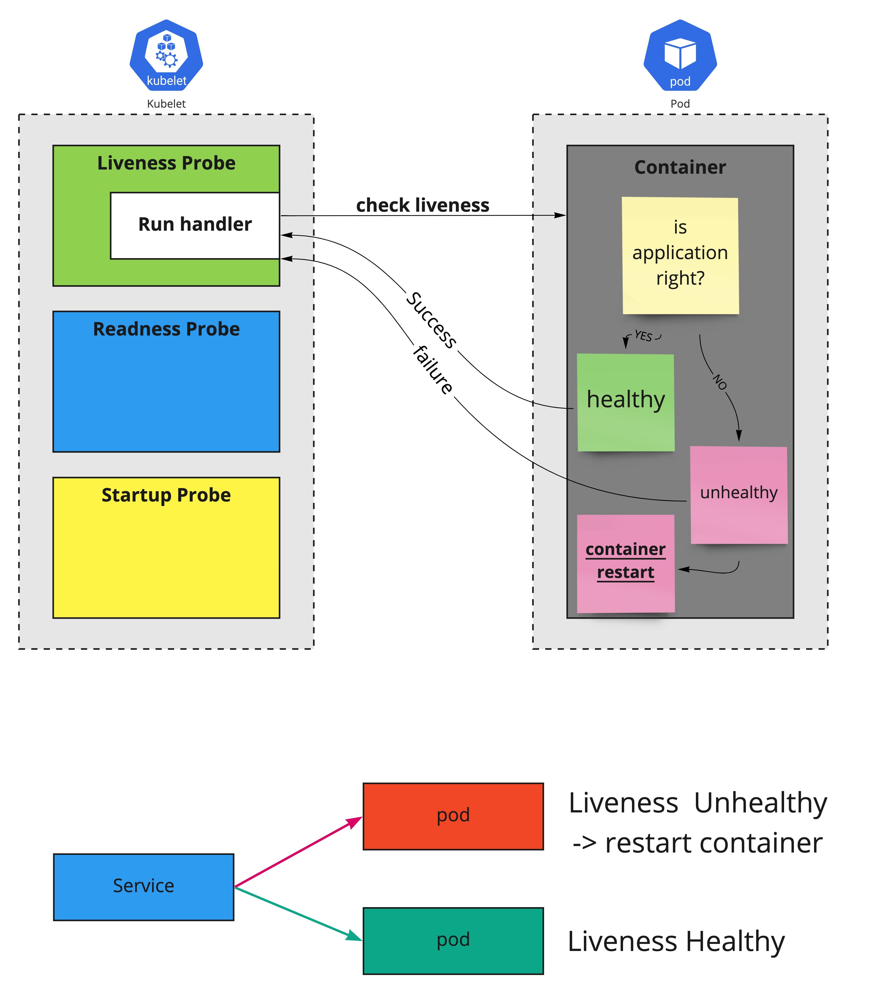
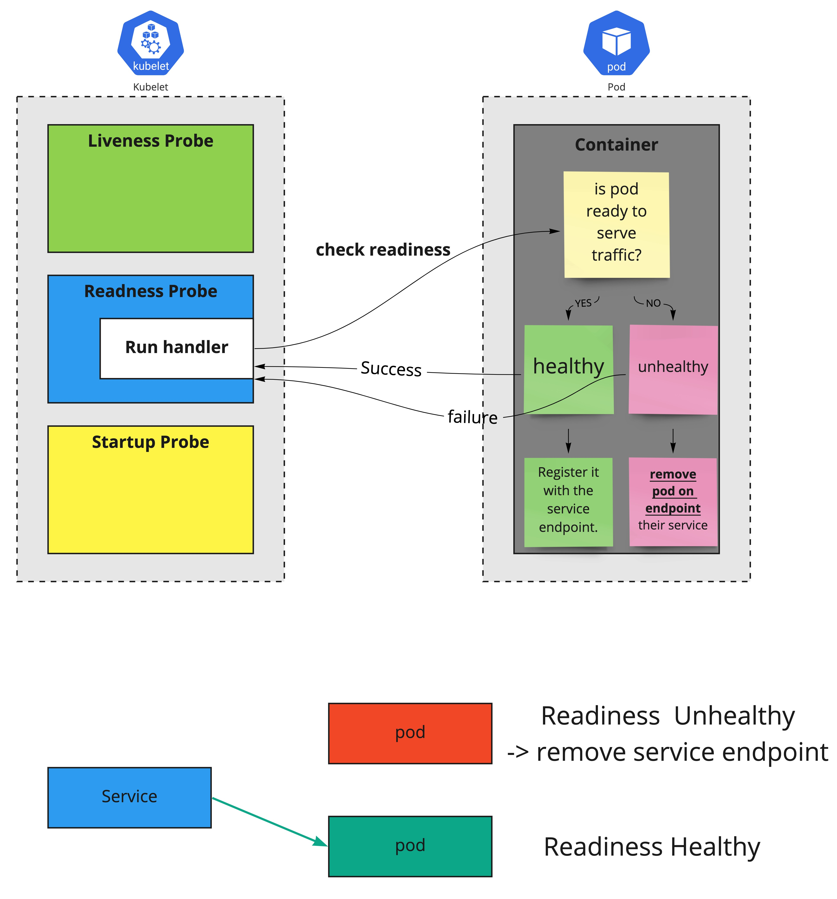
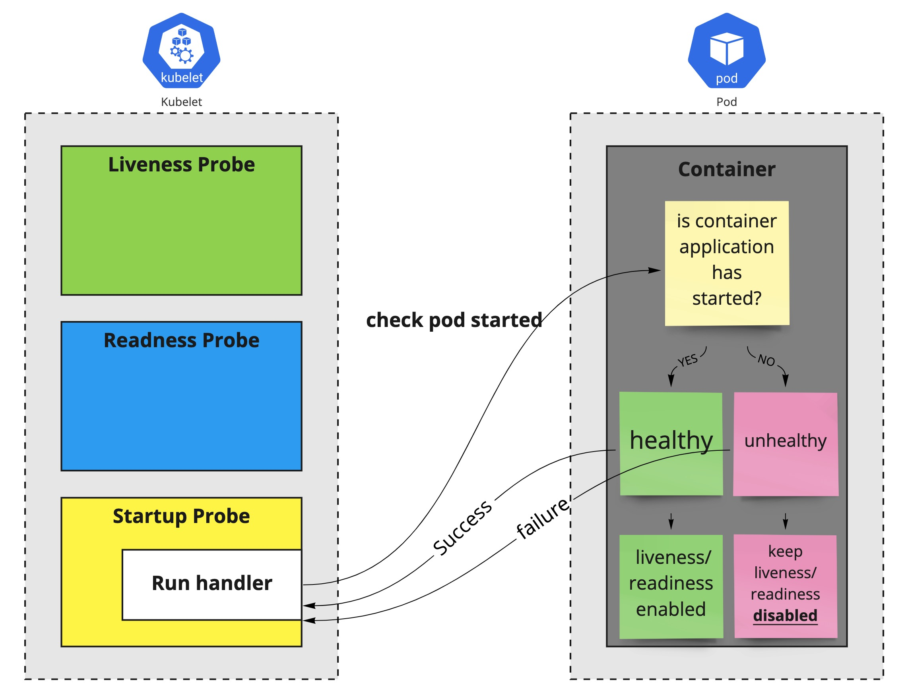

# Liveness, Readiness and Startup Probes

## Liveness
kubelet은 ***liveness probes***를 <u>컨테이너의 재시작할 시점(application의 deadlock등)을 알기 위해 사용</u>한다. application이 실행중이지만 진행 불가능 할때, 컨테이너를 재시작 하는것으로 어플리케이션의 가용성을 높힐수 있다. kubelet은 liveness probe handler를 이용하여 주기적으로 상태를 확인하며, 실패할 경우 pod를 종료한다(SIGTERM). liveness probe는 application이 잘못된 상태를 확인하고 복원한다.


```yaml
# ref: https://kubernetes.io/docs/tasks/configure-pod-container/configure-liveness-readiness-startup-probes/
apiVersion: v1
kind: Pod
metadata:
  labels:
    test: liveness
  name: liveness-http
spec:
  containers:
  - name: liveness
    image: k8s.gcr.io/liveness
    args:
    - /server
    livenessProbe:
      httpGet:
        path: /healthz
        port: 8080
        httpHeaders:
        - name: Custom-Header
          value: Awesome
      initialDelaySeconds: 3
      periodSeconds: 3
```
!!! INFO
    위 yaml은 단독 컨테이너를 갖는 pod에서 livenessProbe를 설정한 내용
    periodSeconds는 kubelet이 매 3초마다 liveness probe가 실행되는것을 정의한다.
    initialDelaySeconds는 kubelet이 첫 probe 실행전에 대기하기 위한 시간(단위: sec)을 명시한다.
    kubelet이 probe를 실행하면, kubelet은 http handler를 사용하여 GET request를 서버로 보내고,
    지정한 path를 통해 success가 돌아오면 healthy. failure가 돌아오면 컨테이너를 종료하고 재시작한다.

## Readiness
kubelet은 ***readiness probe***으로 <u>컨테이너가 트래픽을 받을수 있는 준비가 된 시점</u>을 확인한다. pod은 모든 컨테이너가 준비되면 트래픽을 받을 준비가 된것으로 생각한다. 이 신호의 용도는 어떤 pod이 서비스의 백엔드로 사용될지 제어하는것이다. pod이 준비되어 있지 않으면 service loadbalancer에서 제거한다.(endpoint 제거) readiness probe는 pod의 전체 life cycle동안 실행된다. 이것은 readiness probe가 pod가 실행되는 동안 반복적으로 실행되는것을 의미한다. 이 특징으로 application이 일시적으로 트래픽을 받지 못하는 상황의 처리도 가능하게 한다. 이러한 경우 application을 종료하는것이 아니고, 복구(조건이 만족될때)될때까지 기다린다.


```yaml
# ref: https://kubernetes.io/docs/tasks/configure-pod-container/configure-liveness-readiness-startup-probes/
apiVersion: v1
kind: Pod
metadata:
  name: goproxy
  labels:
    app: goproxy
spec:
  containers:
  - name: goproxy
    image: k8s.gcr.io/goproxy:0.1
    ports:
    - containerPort: 8080
    readinessProbe:
      tcpSocket:
        port: 8080
      initialDelaySeconds: 5
      periodSeconds: 10
    livenessProbe:
      tcpSocket:
        port: 8080
      initialDelaySeconds: 15
      periodSeconds: 20
```
!!! INFO
    kubelet은 readinessProbe.initialDelaySeconds에 명시된 5초 뒤에 첫번째 readiness를 시작합니다.
    probe가 성공하면 pod이 ready된 것으로 status가 변경됩니다.
    kubelet은 periodSeconds에 명시된 10초 마다 검사를 진행합니다.
    livenessProbe도 명시된 내용대로 진행됩니다.

## Startup
kubelet은 ***startup probe***를 <u>컨테이너 어플리케이션이 시작된 시점</u>을 알기 위해 사용한다. 만약 이 probe가 설정되어있고, 그것의 liveness, readiness 가 startup probe가 성공할때까지 disable 이라면, 이 두 <u>probe가 어플리케이션 시작시 간섭하지 않는것을 확인</u>한다. 이것은 컨테이너 시작이 느려서 kubelet에 의해 올라오고 실행되기전에 죽는것을 피하기 위해  liveness check 적용시 사용된다. startup probe는 시작이 느린 컨테이너 또는 예측할수 없는 초기화 프로세스가 있는 application에 최적화되어 있다. ```failureThreshold * periodSeconds``` 만큼 liveness/readiness probe를 기다렸다가 startup probe가 성공하면 이후에 실행된다.

```yaml
apiVersion: v1
kind: Pod
metadata:
  labels:
    test: startup
  name: startup-probe-test
spec:
  containers:
  - name: liveness
    image: k8s.gcr.io/liveness
    args:
    - /server
    startupProbe:
      httpGet:
        path: /healthz
        port: liveness-port
      failureThreshold: 30
      periodSeconds: 10
    livenessProbe:
      httpGet:
        path: /healthz
        port: liveness-port
      failureThreshold: 1
      periodSeconds: 10
```
!!! INFO
    startupProbe에 명시되어 있는 failureThreshold * periodSeconds(300초) 최대 시간까지
    application이 시작될 시간을 확보할수 있다. startupProbe가 성공하면, livenessProbe가 바로 동작하여
    deadlock상태를 확인한다. startupProbe가 주어진 최대 시간동안 성공하지 못하면 컨테이너는 종료되고,
    restartPolicy에 맞게 동작한다.

## PodSpec에 포함되어 있는 Probe
```bash
spec.containers[].livenessProbe
spec.containers[].readinessProbe
spec.containers[].startupProbe
```


## Probe handler type
* [api document reference](https://kubernetes.io/docs/reference/generated/kubernetes-api/v1.23/#probe-v1-core)

위에서 이야기한 probe는 컨테이너에서 kubelet에 의해 주기적으로 수행되는 진단이다. 이 진단을 수행하기 위해서 각 상황에 맞춰 아래의 handler를 사용할 수 있다. 아래의 각 핸들러에서 필요한 설정은 위 api doc에서 참고 가능하다.

### exec - ExecAction
* 지정한 커맨드를 컨테이너 내부에서 실행하여 상태를 판단함. 컨테이너 파일 시스템의 root(“/”)에서 실행함
* exit 0이면 healthy no-zero면 unhealthy

### tcp - TCPSocketAction
* 지정한 tcp socket 포트를 컨테이너에서 열려고 시도하여 상태를 판단함.
* 커넥션이 생성되면 healty, 실패하면 unhealthy

### httpget - HTTPGetAction
* 지정한 포트, 호스트와 path를 가지고 http get 실행을 통해 상태를 판단함.
* 응답의 status code가 200크고 400미만이면 healthy, 그외는 unhealthy

### grpc - GRPCAction
* alpha feature on v1.23 - feature gate에서 GRPC컨테이너Probe enable해야 함
* 지정한 포트, 서비스 이름을 가지고 rpc check 요청을 보내서 상태를 판단함
* 응답이 SERVING(OK)이면 healthy, 그 외는 unhealthy


## Configure Probes
probe는 liveness/readiness의 확인 동작을 보다 정확하게 제어하기 위해 사용할수 있는 여러 필드가 있다.

* initialDelaySeconds: probe를 시작하기 전에 컨테이너가 시작할때 필요한 시간(초)이다. default 0
* periodSeconds: probe를 실행하는 빈도의 기간 시간(초)이다. default 10초, min 1초
* timeoutSeconds: probe를 실행한 후에 timeout 되는 시간(초)이다. default 1초, min 1초
* successThreshold: probe가 실패한 후에 성공한것으로 간주하는 최소의 연속된 성공의 수. default 1, min 1
* failureThreshold: probe가 실패하면 kubernete가 이 회수만큼 시도한 후에 포기함. livenessprobe의 경우, conatiner를 재시작하는것을 의미하고, readiness probe의 경우 Unready로 표기함. default 3, min 1

위 probe 는 아래의 status를 가진다.

* Success: 컨테이너가 probe 를 통과함
* Failure: 컨테이너가 probe 를 실패함
* Unknown: probe가 실패하였다. (어떤 액션도 해서는 안된다. 그리고 kubelet이 추가 확인을 할것이다.)
