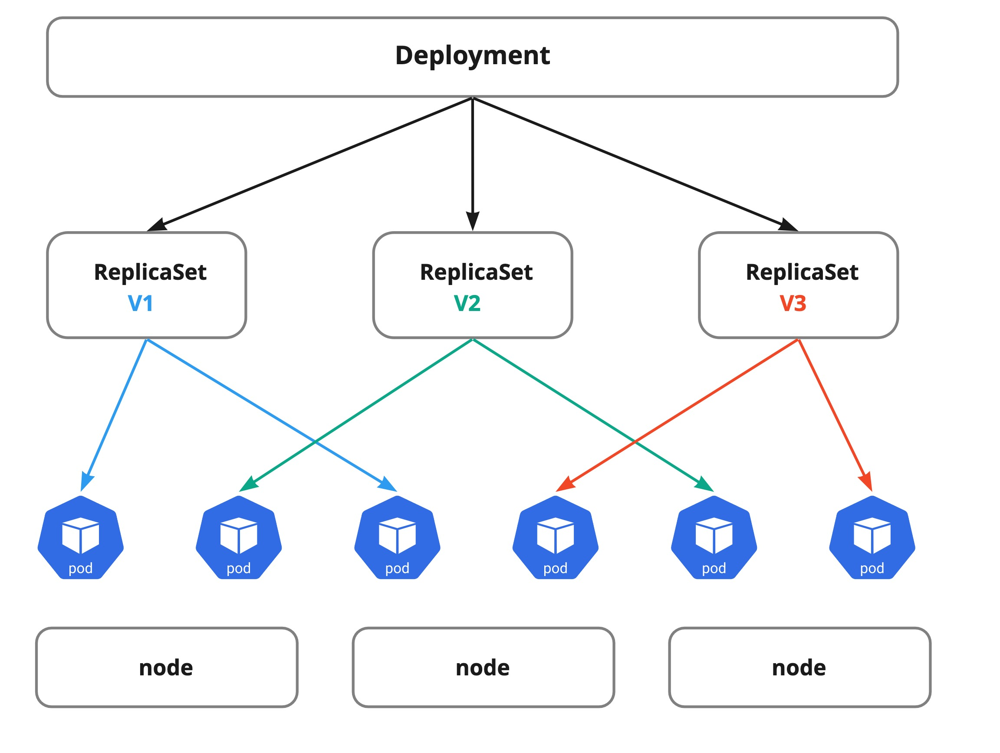

# 2.4 ReplicaSet & Deployment

Pod 리소스를 직접 명령어를 통해서 배포도 가능하지만 보다 효과적으로 리소스를 배포, 관리를 하기 위해서는 Deployment, StatefulSet와 같은 쿠버네티스 오브젝트를 활용해야 한다. Deployments에는 container image, replica 개수, spec 등등이 desired state 작성되며 controller가 리소스를 모니터링하고 배포, 스케쥴링 하면서 실제 상태를 선언된 상태와 동일하게 맞춘다. 실제 Pod들의 spec과 상태를 모니터링 하고 관리 하는 역할은 ReplicaSet이 하며 사용자는 직접 ReplicaSet을 관리 운영 할일이 없으며 Deployment를 통해 제어가 된다.

## Deployment

Deployment를 생성을 하거나 업데이트를 하면 컨트롤러는 해당되는 리소스가 현재 존재하는지 확인 후 지정된 복제본(replicas)과 실제 복제본을 일치 시키는 작업을 진행 한다. Deployment는 직접 복제본을 관리하지 않으며 대신 ReplicaSet이 복제본에 대한 관리를 수행 한다.

## ReplicaSet

ReplicaSet은 지정된 수의 Pod 여러 개를 항상 가용하게 만들어주는 역할을 한다

## Deployment Strategies

기본은 RollingUpdate 이며 새로운 버전의 컨테이너가 배포 될때 Rolling으로 신규 Pod를 배포, 기존 Pod를 삭제 하는 전략 이다.