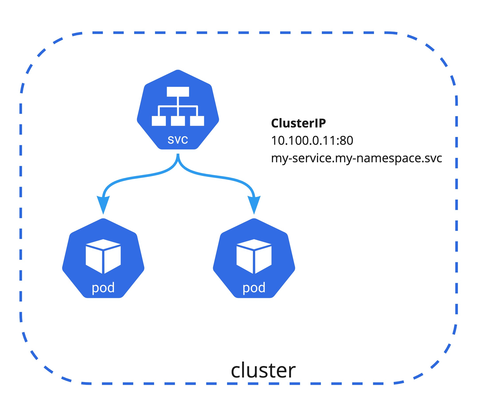

# 2.3 Service & Ingress

## Service란

쿠버네티스에서 서비스는 여러 개의 분산된 형태로 배포된 Pod 들을 하나의 엔드포인트로 접근할 수 있게 한 리소스이다. 서비스를 통해 pod에 접근할 수 있으며 서비스의 종류는 ClusterIP, NodePort, LoadBalancer, 그리고 Headless 타입이 존재한다. 서비스 타입에 따서 내부 클러스터 IP 혹은 외부 IP 주소가 할당되며 서비스에 연동된(label이 매칭된) 파드 중 하나로 라우팅이 된다. 타입이 headless인 경우는 별도의 엔드포인트의 주소가 나오는 것이 아닌 서비스에 연결된 전체 Pod의 IP 목록이 호출된다.

서비스는 기본으로 노드에 있는 [iptables 프록시 모드](https://kubernetes.io/ko/docs/concepts/services-networking/service/#proxy-mode-iptables)로 동작하며 iptables 설정값으로 관리가 되며 정상적으로 수행되고 있는 백엔드 파드로만 연결된다. 또한 서비스는 namespace에 귀속이 되므로 다른 namespace에 있는 앱이 접근해야 하는 경우 `<service>.<namespace>.svc`로 접근할 수 있으며 서비스를 외부로 노출하고자 할 때는 NodePort, LoadBalancer, 그리고 아래서 따로 설명하는 Ingress를 사용하면 된다.
<p align="center"><iframe width="560" height="315" src="https://www.youtube.com/embed/NFApeJRXos4" title="YouTube video player" frameborder="0" allow="accelerometer; autoplay; clipboard-write; encrypted-media; gyroscope; picture-in-picture" allowfullscreen></iframe></p>

### Service Type

| Type      | Description                          |
| ----------- | ------------------------------------ |
| ClusterIP  | 기본값이며 내부 클러스터 IP 주소를 할당 받아 서비스 | 
| NodePort | Node의 Port 범위(30000-32767)중 하나가 할당이 되며 클라이언트가 해당 노드의 IP 주소와 할당된 Port로 서비스 |
| LoadBalancer  | 클러스터에 구성된 네트워크 부하 분산기의 IP 혹은 클라우드의 경우 클러스터에 연동된 Cloud-Native LB의 IP 주소로 서비스 |
| Headless  | 하나의 대표 IP 주소가 아닌 모든 Pod의 IP을 리스트로 제공, Zookeeper처럼 서버의 모든 IP를 알아야할 경우 적합 |

#### ClusterIP

type의 기본값이며 내부 클러스터 IP 주소를 할당 받아 서비스가 된다. 클러스터 내부의 다른 애플리케이션에서 ClusterIP로도 접근 가능하며 자동으로 클러스터 내부에 생성된 CNAME `<service>.<namespace>.svc.<cluster_domain>`
[DNS Records](https://kubernetes.io/docs/concepts/services-networking/dns-pod-service/#services) 로도 접근 가능하다.



```bash
kubectl run http --image=busybox --port=80

```

#### NodePort

### Load Balancer

클러스터에서 여러개의 LoadBalancer가 존재 한다면 해당 LB class 이름을 Annotation에 입력하여 해당 인그래스에 연동 할 수 있다.
예를 들면 AWS EKS환경에서 External NLB가 아닌 Internal NLB로 사용 하고 싶은 경우는 다음과 같이 설정 가능하다

```
service:
  type: LoadBalancer
  nodePort:
  port: 3100
  annotations: 
    service.beta.kubernetes.io/aws-load-balancer-internal: "true"
    service.beta.kubernetes.io/aws-load-balancer-scheme: internal
    service.beta.kubernetes.io/aws-load-balancer-type: nlb
```

### Headless

## Ingress란

Ingress는 클러스터 외부에서 클러스터 내부 서비스로 HTTP와 HTTPS 경로를 노출하고 뒷단의 Service로 라우팅시켜주는 역할을 한다.


만약 클라우드 환경에서 쿠버네티스를 쓴다면 클라우드 프로바이더가 managed 형태로 제공해주는 인그래스 컨트롤러를 써도 좋다. 예를 들면 AWS에서 기본 Ingress는 ALB로 매핑이 되며, GCP는 기본으로 GCP HTTP(S) LoadBalancer로 연동이 된다. 이것은 클라우드 프로바이더가 관리해 주는 리소스이기 때문에 간편하게 사용 할 수 있다. 하지만 다양한 기능들을 커스텀하게 사용하고 싶다거나 self managed 할 수밖에 없는 상황인 경우는 다른 Ingress Controller를 고려해야 한다. 
오픈소스로는 Kubernetes에서 공식적으로 지원하는 [Ingress-Nginx](https://github.com/kubernetes/ingress-nginx/tree/main/charts/ingress-nginx)가 가장 대표적이며 신뢰 할수 있는 솔루션이다.

클러스터에서 여러개의 인그래스 컨트롤러가 존재 한다면 해당 ingress class 이름을 Annotation에 입력하여 해당 인그래스에 연동 할 수 있으며 Target Group Rule, Sticky session과 같은 ALB 설정도 annotation에서 처리 가능하다. [ALB Ingress Annotation](https://kubernetes-sigs.github.io/aws-load-balancer-controller/v2.2/guide/ingress/annotations/#traffic-routing)

```
metadata:
  namespace: default
  name: ingress
  annotations:
    kubernetes.io/ingress.class: alb
    alb.ingress.kubernetes.io/scheme: internet-facing
    alb.ingress.kubernetes.io/target-group-attributes: stickiness.enabled=true,stickiness.lb_cookie.duration_seconds=60
    alb.ingress.kubernetes.io/actions.forward-multiple-tg: >
      {"type":"forward","forwardConfig":{"targetGroups":[{"serviceName":"service-1","servicePort":"http","weight":20},{"serviceName":"service-2","servicePort":80,"weight":20},{"targetGroupARN":"arn-of-your-non-k8s-target-group","weight":60}],"targetGroupStickinessConfig":{"enabled":true,"durationSeconds":200}}}
```