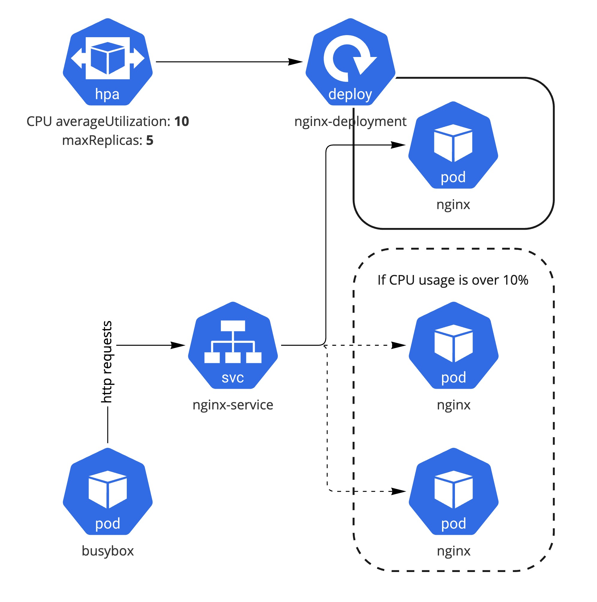

# 핸즈온 3.1 HPA

**CPU Utilization을 기반으로 Pod Autoscaling을 해보는 실습**

로컬 쿠버네티스 환경에서 Nginx Deployment에 HPA를 설정 후 부하를 일으켜 자동 확장을 해보는 실습

## 사전 준비 사항

Kind Kubernetes Cluster 구성: [실습 링크](../../section01/handson/setup-local-k8s-kind.md)

HPA의 이해: [관련 링크](../horizontal-pod-autoscaling.md)

## Architecture

Nginx 리소스, HPA 설정 및 부하테스트용 busybox 구성



## 1 Nginx 리소스 구성

Nginx deployment 배포 및 DNS로 접근 할 수 있도록 service를 구성

**Deployments 및 Service 배포**

요청 100m 및 최대 200m CPU 용량을 가진 Nginx 워크로드를 Deployment로 배포 및 service 설정

[nginx-deployment-service.yaml](../snippets/nginx-deployment-service.yaml)

```yaml
apiVersion: apps/v1
kind: Deployment
metadata:
  labels:
    app: nginx
  name: nginx
spec:
  replicas: 1
  selector:
    matchLabels:
      app: nginx
  template:
    metadata:
      labels:
        app: nginx
    spec:
      containers:
      - image: nginx
        name: nginx
        ports:
        - containerPort: 80
        resources:
          limits:
            cpu: 200m
          requests:
            cpu: 100m
---
kind: Service
apiVersion: v1
metadata:
  name: nginx-service
spec:
  selector:
    app: nginx
  ports:
  - port: 80
```

```bash
kubectl apply -f nginx-deployment-service.yaml
```

## 2 Metric Server 구성

[Metric server](https://github.com/kubernetes-sigs/metrics-server)는 기본으로 설치가 되어 있지 않기 때문에 Pod 메트릭 수집을 위한 metic server 구성

!!! INFO
    Public Cloud의 Managed K8S의 경우는 기본으로 metric server가 구성된 경우가 있으며 TOP 사용량 결과가 올바르게 나온다면 활성화가 되어 있는 상태이다.
    ```
    kubectl top pods -n kube-system
    ```

로컬 Kind 환경에서는 metric server deployment에 아래와 같이 TLS를 bypass하고 kubelet의 address type을 Internal IP로 추가 설정해야 한다.

```yaml
    spec:
      containers:
      - args:
        ...
        - --kubelet-insecure-tls
        - --kubelet-preferred-address-types=InternalIP
```

아래 파일은 [metric-server v0.6.1](https://github.com/kubernetes-sigs/metrics-server/releases/tag/v0.6.1)의 install components에 위의 두 argument를 추가 완료된 버전이다.

[kind-metrics-server.yaml](../snippets/kind-metrics-server.yaml)

```bash
kubectl apply -f kind-metrics-server.yaml
```

## 3 HPA 설정

Nginx Deployment 리소스에 CPU averageUtilization 기반으로 Autoscaling 설정

[nginx-hpa.yaml](../snippets/nginx-hpa.yaml)

```yaml
apiVersion: autoscaling/v2
kind: HorizontalPodAutoscaler
metadata:
  name: nginx
spec:
  maxReplicas: 5
  metrics:
  - resource:
      name: cpu
      target:
        averageUtilization: 10
        type: Utilization
    type: Resource
  minReplicas: 1
  scaleTargetRef:
    apiVersion: apps/v1
    kind: Deployment
    name: nginx
```

```bash
kubectl apply -f nginx-hpa.yaml
```

!!! TIP
    만약 Imperative(명령형)하게 nginx deployment에 HPA를 적용 하고자 하면 다음과 같이 가능하다
    ```bash
    kubectl autoscale deployment nginx --cpu-percent=10 --min=1 --max=5
    ```

HPA 설정이 잘 구성 되었는지 확인을 다음과 같이 할 수 있다.

```bash
kubectl get hpa -w

NAME    REFERENCE          TARGETS   MINPODS   MAXPODS   REPLICAS   AGE
nginx   Deployment/nginx   0%/10%    1         5         1          16m
```

!!! INFO
    HPA v2로 custom metric을 기준으로 autoscaling을 수행하고 싶다면 다음 튜토리얼을 참고:  [autoscaling-on-multiple-metrics-and-custom-metrics](https://kubernetes.io/docs/tasks/run-application/horizontal-pod-autoscale-walkthrough/#autoscaling-on-multiple-metrics-and-custom-metrics)

## 4 HPA 동작 검증

구성된 HPA를 검증하기 위해 busybox로 nginx에 부하를 일으켜서 리소스가 자동으로 확장이 되는지 확인해 본다.

### 4.1 부하 생성용 Busybox 배포

Busybox Pod에서 http request를 무제한으로 발생시켜 nginx에 부하가 일어나도록 한다.

```bash
kubectl run -i --tty load-generator --rm --image=busybox:1.28 --restart=Never \
-- /bin/sh -c "while sleep 0.01; do wget -q -O- http://nginx-service; done"
```

!!! TIP
    지속해서 부하를 주기 위해 busybox 수행용 terminal 창을 별도로 열어서 모니터링하도록 한다. 부하를 중단하고 싶을 때는 CTRL+C 를 통해서 Pod를 종료하면 된다.

### 4.2 HPA 동작 확인

Pod의 CPU 사용량이 10% 넘어감에 따라서 정상적으로 replica가 늘어나는지 확인

```bash
kubectl get hpa -w

NAME    REFERENCE          TARGETS   MINPODS   MAXPODS   REPLICAS   AGE
nginx   Deployment/nginx   0%/10%    1         5         1          16m

nginx   Deployment/nginx   12%/10%   1         5         1          17m

nginx   Deployment/nginx   22%/10%   1         5         2          17m

nginx   Deployment/nginx   13%/10%   1         5         3          17m

nginx   Deployment/nginx   8%/10%    1         5         3          17m

nginx   Deployment/nginx   3%/10%    1         5         3          18m

nginx   Deployment/nginx   0%/10%    1         5         3          19m
```

## Clean Up

배포한 StatefulSet 리소스 삭제

```bash
kubectl delete -f nginx-hpa.yaml
kubectl delete -f nginx-deployment-service.yaml
```

kind cluster 삭제
```
kind delete cluster
```
