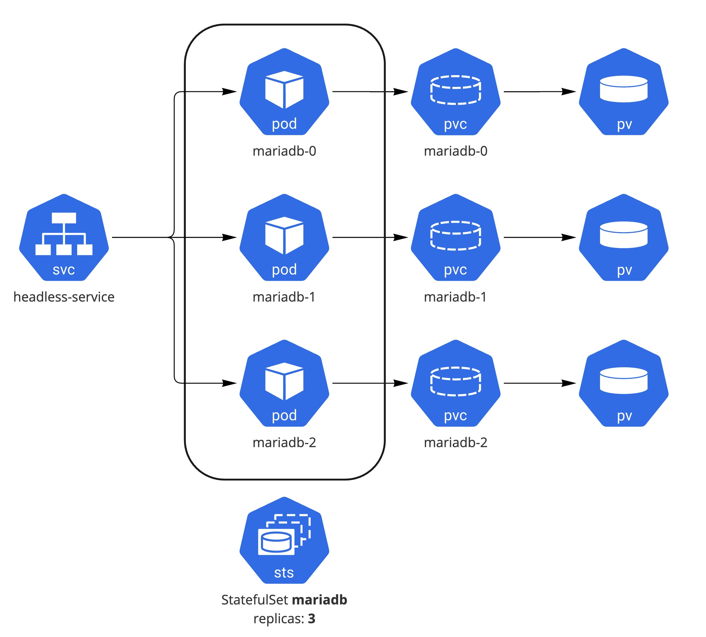

# 핸즈온 3.3 StatefulSet

**StatefulSet로 Mariadb Cluster를 구성 해보는 실습**

로컬 쿠버네티스 환경에서 Mariadb 데이터베이스 클러스터 구성을 위해 Persistent Volume을 포함하여 StatefulSet로 배포 해보는 실습

**Example from**: https://mariadb.org/mariadb-k8s-how-to-replicate-mariadb-in-k8s

## 사전 준비 사항

Kind Kubernetes Cluster 구성: [실습 링크](../../section01/handson/setup-local-k8s-kind.md)

StatefulSet의 이해: [관련 링크](../statefulset.md)

Demo 네임스페이스 생성:
```bash
kubectl create ns mariadb
```

## Architecture

StatefulSet, Service, Persistent Volume을 통해 Mariadb Cluster 구성



## 1 ConfigMap, Service, Secret 구성

Mariadb Cluster의 Primary, Secondary 설정 파일에 대해 ConfigMap으로 구성 및 Mariadb Pod에 DNS로 통신을 할 수 있도록 하기 위해 Headless Service를 구성

### 1.1 ConfigMap 설정

[mariadb-replica-sts.yaml](../snippets/mariadb-replica-sts.yaml)
```yaml
apiVersion: v1
kind: ConfigMap
metadata:
  namespace: mariadb
  name: mariadb-configmap
data:

  primary.cnf: |
    [mariadb]
    log-bin                         # enable binary logging
    log-basename=my-mariadb         # used to be independent of hostname changes (otherwise is in datadir/mysql)

  replica.cnf: |
    [mariadb]
    log-basename=my-mariadb         # used to be independent of hostname changes (otherwise is in datadir/mysql)

  primary.sql: |
    CREATE USER 'repluser'@'%' IDENTIFIED BY 'replsecret';
    GRANT REPLICATION REPLICA ON *.* TO 'repluser'@'%';
    CREATE DATABASE primary_db;

  secondary.sql: |
    # We have to know name of sts (`mariadb`) and
    # service `mariadb-service` in advance as an FQDN.
    # No need to use master_port
    CHANGE MASTER TO
    MASTER_HOST='mariadb-0.mariadb-service.mariadb.svc.cluster.local',
    MASTER_USER='repluser',
    MASTER_PASSWORD='replsecret',
    MASTER_CONNECT_RETRY=10;
```

!!!INFO
    만약 namespace나 service 이름 등을 본인의 환경에 맞춰서 배포하는 경우 MASTER_HOST 값을 변경해야 한다
    `mariadb-0.<headless service name>.<namespace name>.svc.cluster.local`

### 1.2 Headless Service 설정

DNS로 Primary, Secondary간 통신을 위한 Headless Serivce 설정

[mariadb-replica-sts.yaml](../snippets/mariadb-replica-sts.yaml)
```yaml
apiVersion: v1
kind: Service
metadata:
  namespace: mariadb
  name: mariadb-service
  labels:
    app: mariadb
spec:
  ports:
  - port: 3306
    name: mariadb-port
  clusterIP: None
  selector:
    app: mariadb
```

### 1.3 Secret 설정

Secret에 DB root password를 저장

!!! INFO
    쿠버네티스에서 Secret은 텍스트를 base64로 인코딩하는 것이며 암호화(encryption)는 아니기 때문에 Hashicorp Vault나 클라우드 프로바이더에서 제공하는 Secret Manager 서비스를 사용하는 것이 보안 측면에서 뛰어나다.

[mariadb-replica-sts.yaml](../snippets/mariadb-replica-sts.yaml)
```yaml
apiVersion: v1
kind: Secret
metadata:
    namespace: mariadb
    name: mariadb-secret
type: Opaque
data:
  mariadb-root-password: c2VjcmV0 # echo -n 'secret'|base64
```

### 1.4 ConfigMap, Service, Secret 설정

ConfigMap, Service, Secret이 정상적으로 배포 되었는지 확인

```bash
kubectl get svc,configmap,secret
NAME                      TYPE        CLUSTER-IP   EXTERNAL-IP   PORT(S)    AGE
service/mariadb-service   ClusterIP   None         <none>        3306/TCP   24s

NAME                          DATA   AGE
configmap/kube-root-ca.crt    1      4d14h
configmap/mariadb-configmap   4      24s

NAME                    TYPE     DATA   AGE
secret/mariadb-secret   Opaque   1      24s
```

## 2 StatefulSet 구성

Mariadb Cluster의 실제 워크로드인 MariaDB를 StatefulSet으로 배포

### 2.1 StatefulSet 설정

예제의 MariaDB Pod는 initContainers와 Containers로 구성이 되어져 있으며 initContainers(name: init-mariadb)를 통해서 설정값(configmap)을 /etc/mysql/conf.d/ 볼륨에 초기 구성 하는 작업을 진행 하여 실제 워크로드는 MariaDB containers(name: mariadb)에서 서비스 된다

[mariadb-replica-sts.yaml](../snippets/mariadb-replica-sts.yaml)
```yaml
apiVersion: apps/v1
kind: StatefulSet
metadata:
  name: mariadb
spec:
  serviceName: "mariadb-service"
  replicas: 3
  selector:
    matchLabels:
      app: mariadb
  template:
    metadata:
      labels:
        app: mariadb
    spec:
      initContainers:
      - name: init-mariadb
        image: mariadb
        imagePullPolicy: Always
        command:
        - bash
        - "-c"
        - |
          set -ex
          echo 'Starting init-mariadb';
          # Check config map to directory that already exists
          # (but must be used as a volume for main container)
          ls /mnt/config-map
          # Statefulset has sticky identity, number should be last
          [[ `hostname` =~ -([0-9]+)$ ]] || exit 1
          ordinal=${BASH_REMATCH[1]}
          # Copy appropriate conf.d files from config-map to
          # mariadb-config volume (emptyDir) depending on pod number
          if [[ $ordinal -eq 0 ]]; then
            # This file holds SQL for connecting to primary
            cp /mnt/config-map/primary.cnf /etc/mysql/conf.d/server-id.cnf
            # Create the users needed for replication on primary on a volume
            # initdb (emptyDir)
            cp /mnt/config-map/primary.sql /docker-entrypoint-initdb.d
          else
            # This file holds SQL for connecting to secondary
            cp /mnt/config-map/replica.cnf /etc/mysql/conf.d/server-id.cnf
            # On replicas use secondary configuration on initdb volume
            cp /mnt/config-map/secondary.sql /docker-entrypoint-initdb.d
          fi
          # Add an offset to avoid reserved server-id=0 value.
          echo server-id=$((3000 + $ordinal)) >> etc/mysql/conf.d/server-id.cnf
          ls /etc/mysql/conf.d/
          cat /etc/mysql/conf.d/server-id.cnf
        volumeMounts:
          - name: mariadb-config-map
            mountPath: /mnt/config-map
          - name: mariadb-config
            mountPath: /etc/mysql/conf.d/
          - name: initdb
            mountPath: /docker-entrypoint-initdb.d
      restartPolicy: Always
      containers:
      - name: mariadb
        image: mariadb
        ports:
        - containerPort: 3306
          name: mariadb-port
        env:
        # Using Secrets
        - name: MARIADB_ROOT_PASSWORD
          valueFrom:
            secretKeyRef:
              name: mariadb-secret
              key: mariadb-root-password
        - name: MYSQL_INITDB_SKIP_TZINFO
          value: "1"
        # Mount volume from persistent volume claim
        volumeMounts:
        - name: datadir
          mountPath: /var/lib/mysql/
        - name: mariadb-config
          mountPath: /etc/mysql/conf.d/
        - name: initdb
          mountPath: /docker-entrypoint-initdb.d
      volumes:
      - name: mariadb-config-map
        configMap:
          name: mariadb-configmap
          #defaultMode: 0544
      - name: mariadb-config
        emptyDir: {}
      - name: initdb
        emptyDir: {}

  volumeClaimTemplates:
  - metadata:
      name: datadir
    spec:
      accessModes: [ "ReadWriteOnce" ]
      resources:
        requests:
          storage: 300M
```

```bash
kubectl apply -f mariadb-replica-sts.yaml
```

### 2.2 배포된 Pod 및 Volume 확인

Pod 배포가 정상적으로 3대(replicas: 3)가 되었는지 확인

```bash
kubectl get pods -l app=mariadb
NAME        READY   STATUS    RESTARTS   AGE
mariadb-0   1/1     Running   0          11s
mariadb-1   1/1     Running   0          11s
mariadb-2   1/1     Running   0          11s
```

!!! INFO
     기본으로 Dynamic Provisioner가 구성이 되어 있으므로 PV는 PVC 요청시 자동으로 생성

StatefulSet 배포시 PV 생성 및 PVC에 Bound 된 것을 확인

```bash
kubectl get pv,pvc

NAME                                                        CAPACITY   ACCESS MODES   RECLAIM POLICY   STATUS        CLAIM                                  STORAGECLASS   REASON   AGE
persistentvolume/pvc-0220af2d-8020-4a3b-96b5-6195aa3945b0   300M       RWO            Delete           Bound         mariadb/datadir-mariadb-0              standard                20s
persistentvolume/pvc-3c897244-b250-4a5e-9dd3-324da13696aa   300M       RWO            Delete           Bound         mariadb/datadir-mariadb-1              standard                20s
persistentvolume/pvc-951c940c-5d9b-4f46-afe3-3ee94435d491   300M       RWO            Delete           Bound         mariadb/datadir-mariadb-2              standard                20s

NAME                                      STATUS   VOLUME                                     CAPACITY   ACCESS MODES   STORAGECLASS   AGE
persistentvolumeclaim/datadir-mariadb-0   Bound    pvc-0220af2d-8020-4a3b-96b5-6195aa3945b0   300M       RWO            standard       20s
persistentvolumeclaim/datadir-mariadb-1   Bound    pvc-3c897244-b250-4a5e-9dd3-324da13696aa   300M       RWO            standard       20s
persistentvolumeclaim/datadir-mariadb-2   Bound    pvc-951c940c-5d9b-4f46-afe3-3ee94435d491   300M       RWO            standard       20s
```

### 2.3 MariaDB Cluster 구성 확인

배포된 MariaDB Cluster가 정상적으로 Primary/Secondary 구성을 가지고 있는지 검증

#### Primary DB에 Dummy Data 추가

PrimaryDB(mariadb-0) Pod에 shell 접근

!!! INFO
    secret에서 mariadb-root-password 바꾼 경우 해당 password로 변경 하여 접근

```bash
kubectl exec -it mariadb-0 -- mariadb -uroot -psecret

Defaulted container "mariadb" out of: mariadb, init-mariadb (init)
Welcome to the MariaDB monitor.  Commands end with ; or \g.
Your MariaDB connection id is 8
.....

# Secondary에서 repluser로 Binary log dump가 정상적으로 이루어지고 있는지 확인
MariaDB [primary_db]> SHOW PROCESSLIST;
+----+----------+-------------------+------------+-------------+-------+---------------------------------------------------------------+------------------+----------+
| Id | User     | Host              | db         | Command     | Time  | State                                                         | Info             | Progress |
+----+----------+-------------------+------------+-------------+-------+---------------------------------------------------------------+------------------+----------+
|  4 | repluser | 10.244.1.22:44876 | NULL       | Binlog Dump | 60552 | Master has sent all binlog to slave; waiting for more updates | NULL             |    0.000 |
|  5 | repluser | 10.244.3.25:53204 | NULL       | Binlog Dump | 60544 | Master has sent all binlog to slave; waiting for more updates | NULL             |    0.000 |
|  8 | root     | localhost         | primary_db | Query       |     0 | starting                                                      | SHOW PROCESSLIST |    0.000 |
+----+----------+-------------------+------------+-------------+-------+---------------------------------------------------------------+------------------+----------+
3 rows in set (0.001 sec)

MariaDB [(none)]> SHOW DATABASES;
+--------------------+
| Database           |
+--------------------+
| information_schema |
| mysql              |
| performance_schema |
| primary_db         |
| sys                |
+--------------------+
5 rows in set (0.004 sec)

MariaDB [(none)]> USE primary_db;
Reading table information for completion of table and column names
You can turn off this feature to get a quicker startup with -A

Database changed
MariaDB [primary_db]>

# Dummy Data 추가를 위한 Table 생성
MariaDB [primary_db]> CREATE TABLE test (
    ->         id INTEGER NOT NULL AUTO_INCREMENT,
    ->         content VARCHAR(255) NOT NULL,
    ->         PRIMARY KEY (id)
    -> ) ;
Query OK, 0 rows affected (0.013 sec)

# Dummy Data 추가
MariaDB [primary_db]> INSERT INTO `test` (
    ->     `content`)
    ->     values
    ->     ('first');
Query OK, 1 row affected (0.007 sec)

MariaDB [primary_db]> SELECT * FROM test;
+----+---------+
| id | content |
+----+---------+
|  1 | first   |
+----+---------+
1 row in set (0.001 sec)
```

dummy table, data 셈플 쿼리: [init-table-data.txt](../snippets/init-table-data.txt)

#### Secondary DB에서 Data 확인

두개의 Secondary(mariadb-1 혹은 2) 중 하나에 shell로 접근

```bash
kubectl exec -it mariadb-2 -- mariadb -uroot -psecret

Defaulted container "mariadb" out of: mariadb, init-mariadb (init)
Welcome to the MariaDB monitor.  Commands end with ; or \g.
Your MariaDB connection id is 6
Server version: 10.9.2-MariaDB-1:10.9.2+maria~ubu2204 mariadb.org binary distribution

Copyright (c) 2000, 2018, Oracle, MariaDB Corporation Ab and others.

Type 'help;' or '\h' for help. Type '\c' to clear the current input statement.

MariaDB [(none)]>

# Secondary가 정상적으로 Primary의 데이터를 Dumping 하고 있는지 확인
MariaDB [(none)]> SHOW SLAVE STATUS \G;
*************************** 1. row ***************************
                Slave_IO_State: Waiting for master to send event
                   Master_Host: mariadb-0.mariadb-service.mariadb.svc.cluster.local
                   Master_User: repluser
                   Master_Port: 3306
                 Connect_Retry: 10
               Master_Log_File: my-mariadb-bin.000002
           Read_Master_Log_Pos: 2492
                Relay_Log_File: my-mariadb-relay-bin.000004
                 Relay_Log_Pos: 2796
         Relay_Master_Log_File: my-mariadb-bin.000002
              Slave_IO_Running: Yes
...
                 Parallel_Mode: optimistic
                     SQL_Delay: 0
           SQL_Remaining_Delay: NULL
       Slave_SQL_Running_State: Slave has read all relay log; waiting for more updates
              Slave_DDL_Groups: 7
Slave_Non_Transactional_Groups: 0
    Slave_Transactional_Groups: 5
1 row in set (0.001 sec)

ERROR: No query specified

MariaDB [(none)]> USE primary_db
Reading table information for completion of table and column names
You can turn off this feature to get a quicker startup with -A

Database changed

# Dummy Data 확인
MariaDB [primary_db]> SELECT * FROM test;
+----+---------+
| id | content |
+----+---------+
|  1 | first   |
+----+---------+
1 row in set (0.001 sec)
```

### 2.4 MariaDB Cluster 스케일 조정

replicaset의 설정을 업데이트 하며 cluster의 스케일 조절 및 접근 확인

```bash
kubectl get pods -l app=mariadb

NAME        READY   STATUS    RESTARTS   AGE
mariadb-0   1/1     Running   0          24h
mariadb-1   1/1     Running   0          24h
mariadb-2   1/1     Running   0          24h

#replica 개수를 4개로 조정(+1)
kubectl scale sts mariadb --replicas=4
statefulset.apps/mariadb scaled

kubectl get pods -l app=mariadb
NAME        READY   STATUS            RESTARTS   AGE
mariadb-0   1/1     Running           0          2h
mariadb-1   1/1     Running           0          2h
mariadb-2   1/1     Running           0          2h
mariadb-3   0/1     PodInitializing   0          8s
```

추가 배포된 secondary db(`mariadb-3`)도 정상적으로 primary를 바라보고 있는지 확인

```
kubectl exec -it mariadb-3 -- mariadb -uroot -psecret
Defaulted container "mariadb" out of: mariadb, init-mariadb (init)
Welcome to the MariaDB monitor.  Commands end with ; or \g.
Your MariaDB connection id is 6
...

Type 'help;' or '\h' for help. Type '\c' to clear the current input statement.

MariaDB [(none)]> SHOW SLAVE STATUS \G;
*************************** 1. row ***************************
                Slave_IO_State: Waiting for master to send event
                   Master_Host: mariadb-0.mariadb-service.mariadb.svc.cluster.local
                   Master_User: repluser
                   Master_Port: 3306
                 Connect_Retry: 10
               Master_Log_File: my-mariadb-bin.000002
               ...
                 Parallel_Mode: optimistic
                     SQL_Delay: 0
           SQL_Remaining_Delay: NULL
       Slave_SQL_Running_State: Slave has read all relay log; waiting for more updates
              Slave_DDL_Groups: 7
Slave_Non_Transactional_Groups: 0
    Slave_Transactional_Groups: 5
1 row in set (0.000 sec)

ERROR: No query specified
```

## Clean Up

배포한 StatefulSet 리소스 삭제

```bash
kubectl delete -f mariadb-replica-sts.yaml
```

!!! WARN
    StatefulSet을 삭제나 스케일다운해도 매핑이 되어 있는 볼륨은 자동으로 삭제되지 않기 때문에 PV, PVC는 수동으로 삭제

kind cluster 삭제
```
kind delete cluster
```
