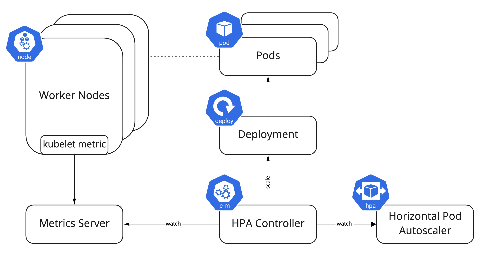

# 3.1 HPA

## Horizontal Pod Autoscaling

쿠버네티스에서는 워크로드를 자동 확장하는 데 일반적으로 HPA(Horizontal Pod Autoscaling)가 기본적으로 사용되며 대표적으로 CPU, 메모리 사용량 메트릭 기반으로 워크로드를 정해진 수치에 맞도록 Deployment, StatefulSet와 같은 워크로드 리소스의 규모를 주기적으로 조정한다.
HPA controller라는 컨트롤러 컴포넌트가 Metric Server에 수집된 메트릭을 기준으로 HorizontalPodAutoscaler 쿠버네티스 api 리소스를 통해 스케일링 조정이 이루어 지며 해당 HorizontalPodAutoscaler는 Deployments 및 ReplicaSet의 크기를 제어한다.



HPA는 DaemonSet과 같은 크기 조절이 불가능한 오브젝트에는 적용할 수 없으며 수평적 확장이므로 할당된 CPU 혹은 Memory 크기를 늘려야 하는 수직적 확장이 필요한 경우는 [Vertical Pod Autoscaler](https://github.com/kubernetes/autoscaler/tree/master/vertical-pod-autoscaler#install-command) CRD(custom resource definition)를 클러스터에 추가하여 사용할 수 있다.

## 알고리즘

기본적인 관점에서 HorizontalPodAutoscaler 컨트롤러는 원하는 메트릭 값(desired)과 현재 메트릭 값(current) 간의 비율을 계산하여 동작 하게 된다.

```
desired replicas
= ceil ( current replicas * ( current metric / desired metric ) )
```

!!!INFO
    ceil() 함수는 올림하여 주어진 숫자보다 크거나 같은 정수를 반환 한다

예를 들어 현재 메트릭 값이 200m이고 원하는 값이 100m이면 복제본 수는 200.0 / 100.0 == 2.0이므로 두 배가 확장이 되며 현재 값이 대신 50m이면 50.0 / 100.0 == 0.5가 되므로 복제본 수를 절반으로 줄이고 비율이 1.0에 가깝게 되면 모든 스케일링이 더 이상 일어나지 않게 된다.

## Scaling

트래픽이 증가하여 Pod의 CPU 사용량이 50%에 도달하게 되면 최대 10개 까지 확장하고 트래픽이 감소하면 리소스를 축소할 수 있도록 HPA를 구성한다.

```yaml
apiVersion: autoscaling/v1
kind: HorizontalPodAutoscaler
...
spec:
 scaleTargetRef:
   apiVersion: apps/v1
   kind: Deployment
   name: nginx
 minReplicas: 1
 maxReplicas: 10
 targetCPUUtilizationPercentage: 50
```


## Scale Down 안정화 하기

Scale Down이 이루어질 때 부하가 갑자기 다시 일어나는 것을 방지하기 위해 안정화를 고려하여 쿨다운(점진적으로 축소)를 할 필요가 있다.

### periodSeconds

스케일 다운 조건에 맞아서 pod를 축소 할때 특정 시간(초, second) 간격으로 쿨다운 할수 있다.

```yaml
behavior:
  scaleDown:
    policies:
    - type: Pods
      value: 4
      periodSeconds: 60
    - type: Percent
      value: 10
      periodSeconds: 60
```
한번 줄어들면 60초 동안은 유지되며 만약 위 설정 처럼 동시에 2개의 정책이 있다면 많은 변경을 허용하는 쪽이 먼저 적용된다.
예를 들어, pod가 20개 라고 가정 하면 10%(2개) < 4개 => 4개가 줄어들며 50개 라고 가정 하면 10%(5개) > 4개    => 5개 줄어들게 된다.

### stabilizationWindowSeconds

또한 안정화 윈도우 시간을 설정하여 스케일 다운이 조건이 만족 되었더라도 특정 주기 동안 메트릭을 모니터링하여 해당 시간 구간에서 가장 높은 값이 스케일다운 조건에 맞았을 때 축소를 진행할 수도 있다. 아래의 예시에서 최근 5분 동안의 모든 상태가 고려 대상이 된다.

```yaml
behavior:
  scaleDown:
    stabilizationWindowSeconds: 300
```
