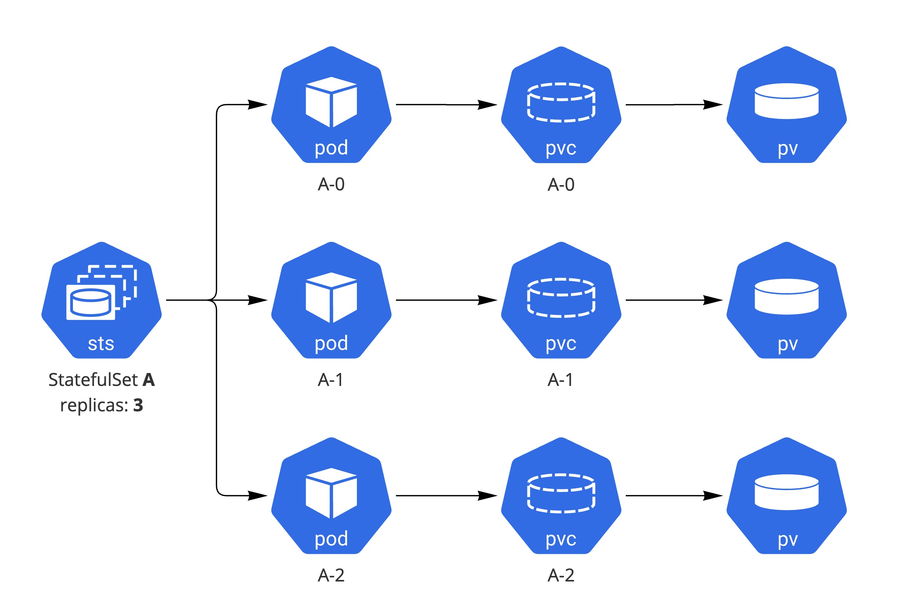
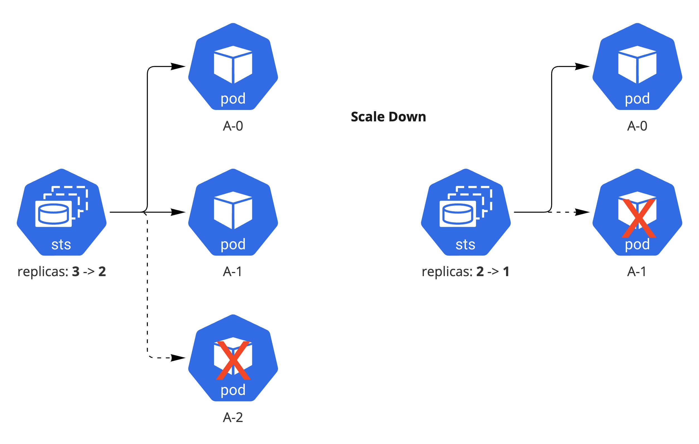

# 3.3 StatefulSet

## StatefulSet

상태가 있는(stateful) 워크로드를 특정 순서에 맞게 배포하고 동일하게 운영하기 위해서 StatefulSet을 활용할 수 있다. StatefulSet을 활용하면 Pod 이름을 순차적으로 부여 할 수 있으며 PV를 Pod에 지속적으로 매핑할 수 있다. 다수 Pod의 형상을 동일하게 관리 한다는 측면에서는 Deployment/ReplicaSet과 유사하지만, StatefulSet은 network나 storage의 리소스가 고정되어 있고 순서에 의해서 Pod가 시작 혹은 중지가 된다는 점이 큰 차이점이다. 결론적으로 StatefulSet은 순차적으로 배포, 식별자 ID가 유지 되어야 하는 DB 혹은 leader/follower 구조의 애플리케이션을 수용하는데 적합하다.



## 특징

- Pod 이름은 replica 개수에 맞게 연속적인 숫자로 생성됨
- 데이터의 유실을 막기 위해 StatefulSet을 삭제나 스케일다운해도 매핑이 되어 있는 볼륨은 자동으로 삭제되지 않는 것이 기본 값
!!! INFO
    1.23 버전부터 명시적으로 수동 scale을 할 경우 volume을 자동 삭제 가능한 [PVC Retain](https://kubernetes.io/docs/concepts/workloads/controllers/StatefulSet/#persistentvolumeclaim-retention) 기능이 alpha에 추가가 되었다.
```
spec:
  persistentVolumeClaimRetentionPolicy:
    whenDeleted: Retain # StatefulSet이 삭제될 때 동작
    whenScaled: Delete # replica 수 scale donw 때 동작
```
- 파드의 번호, 호스트네임, SRV 레코드와 A 레코드이름은 변경되지 않지만 파드의 IP 주소는 변경될 수 있기 때문에 IP가 아닌 DNS로 질의 할 수 있도록 [Headless 서비스](https://kubernetes.io/docs/concepts/services-networking/service/#headless-services)가 필요 (ex, web-0.nginx)
```yaml
kind: Service
metadata:
  name: nginx
spec:
  ports:
  - port: 80
    name: web
  clusterIP: None
  selector:
    app: nginx
```

- 스케일링하는 경우 모든 선행 파드가 Running 및 Ready 상태여야 하며, 스케일다운 하는 경우 후속 파드가 완전히 종료된 후 삭제가 됨


