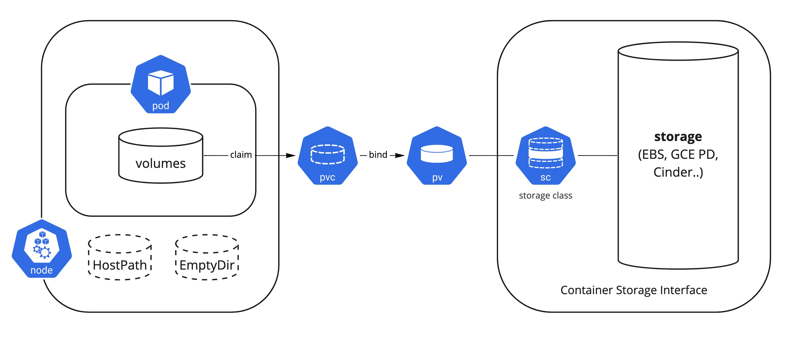

# 3.2 Storage Volumes

상태가 있는 워크로드를 안정적이고 영구적으로 운영하기 위해서는 스토리지가 필요하다. 쿠버네티스에서는 임시(Ephemeral) 데이터 볼륨부터 영구적인(Persistent) 데이터 볼륨까지 다양한 스토리지 옵션을 제공하며 CSI(Container Storage Interface)를 통해서 다양한 스토리지 프로바이더 솔루션과 연동된다.



## Ephemeral Volume

자체 파일시스템을 사용하는 쿠버네티스 리소스(Stateless 워크로드 와 같이 별도의 스토리지 옵션을 주지 않은)는 기본적으로 임시 스토리지를 사용하며 컨테이너가 재시작이 되면 스토리지의 데이터는 유실이 된다. 만약 데이터의 유실에 영향 받지 않으면서 Pod 재시작이나 크래쉬의 영향은 받지 않고 직접 삭제 하기 전까지만 유지하면 되면 되는 스토리지라면 [emptyDir](https://kubernetes.io/docs/concepts/storage/volumes/#emptydir) 볼륨 타입을 사용하면 된다. 외부 스토리지와 연동되어 볼륨이 생성, 관리 되는 것이 아닌 리소스가 동작 중인 노드에서 생성된 볼륨이며 노드의 스토리지뿐만이 아닌 메모리에 마운트하여 사용도 가능하다. 캐시 영역이나 임시로 데이터를 적재해야 하는 공간이 필요한 경우에 적합하다. 노드에 있는 스토리지를 사용한다는 관점에서는 [HostPath](https://kubernetes.io/docs/concepts/storage/volumes/#hostpath)와 비슷하나 노드에 있는 특정 데이터에 불가피하게 접근해서 읽어야 하는 경우가 아니고서는 emptyDir가 사용된다.

```yaml
        volumeMounts:
        - mountPath: /data
          name: redis-data
      volumes:
      - name: redis-data
        emptyDir: {}
```

!!! INFO
    노드에서 Pod에 할당된 emptyDir 볼륨의 위치는
    ```/var/lib/kubelet/pods/PODUID/volumes/kubernetes.io~empty-dir/VOLUMENAME```
    에서 확인 할 수 있다

## Persistant Volume & Claim

PersistentVolume(PV)는 영구적인 스토리지 리소스이며 관리자에 의해서 생성되거나 StorageClasses를 통해 동적으로 프로비저닝된 클러스터의 스토리지이다. PersistentVolumeClaim(PVC)는 리소스에 PV를 바인딩하는 하나의 요청(claim)이며 사용자가 용량과 기능 그리고 접근모드 등을 정의한다. 퍼블릭 클라우드에서 EKS, GKE와 같은 매니지드 쿠버네티스를 사용하는 경우는 PVC만 생성하더라도 동적으로 CSI Provisioner가 요청한 스팩에 맞춰서 PV를 동적으로 프로비저닝 해준다. 정적으로 미리 PV를 만들어 두고 PVC에 바인딩 하여 사용하는 것도 가능하다.

```yaml
kind: PersistentVolumeClaim
metadata:
  name: redis-pvc
spec:
  accessModes:
    - ReadWriteOnce
  resources:
    requests:
      storage: 5Gi
```


[High-level Kubernetes archetypes integrated with CSI](https://kubernetes.io/blog/2018/08/02/dynamically-expand-volume-with-csi-and-kubernetes/)

### Access Modes & Claim Lifecycle

#### Access Modes
PVC에는 아래와 같은 [AccessModes](https://kubernetes.io/docs/concepts/storage/persistent-volumes/#access-modes)가 존재 한다. AWS, Azure와 같이 하나의 스토리지 볼륨이 하나의 서버 노드에만 붙는 경우는 RWO으로만 제한이 되고 GCP처럼 하나의 스토리지 볼륨이 여러 서버 노드에 연결할 수 있는 경우는 RWO, ROX 선택할 수 있다. 각 스토리지 프로바이더별로 제공하는 범위가 다르므로 공식 페이지에서 확인할 수 있다.

- ReadWriteOnce(RWO): 단일 노드에 의해 읽기 쓰기 권한으로 마운트될 수 있으며 동일한 노드에서 실행 중인 여러 파드가 볼륨에 액세스하도록 허용할 수 있다
- ReadOnlyMany(ROX): 여러 노드에서 읽기 전용으로 마운트될 수 있다
- ReadWriteMany(RWX): 여러 노드에서 읽기 쓰기로 마운트될 수 있다
- ReadWriteOncePod(RWOP): 단일 파드에 의해 읽기 쓰기 권한으로 마운트될 수 있으며 하나의 파드에서만 읽고 쓰도록 확실하게 제한을 두고 싶은 경우에 사용할 수 있다. CSI가 지원하고 쿠버네티스 버전이 1.22 이상일 때만 가능하다

!!! INFO
    클라우드 네이티브 환경에서는 RWO, RWOP가 가장 일반적이며 공유가 필요한 저장소가 꼭 있어야 한다면 다양한 솔루션을 통해 대체할 수 있다. 예를 들어 접근해야 하는 경우 파일이라면 S3와 같은 오브젝트 스토리지, 데이터라면 Database, 메시지 라면 메시지큐를 대체제로 사용할 수 있다.

#### Claim Lifecycle

- Binding: pvc에 맞는 pv가 controller에 의해 binding된 상태 이며 동적 프로비저닝된 경우 controller는 항상 pv가 pvc에 바인딩되어 있다
- Using: 클러스터는 클레임을 검사하여 바인딩된 볼륨을 찾고 해당 볼륨이 파드에 마운트가 되어 pvc가 사용중인 상태 이며 pv와 pvc는 1:1로 매핑 된다
- Reclaiming: PV의 반환(회수) 정책은 persistentVolumeReclaimPolicy으로 Retain, Delete, Recycle중 하나로 지정할 수 있고, 동적으로 생성할 경우 StorageClass에 지정되어 있는 ReclaimPolicy에 따라 결정이 된다
