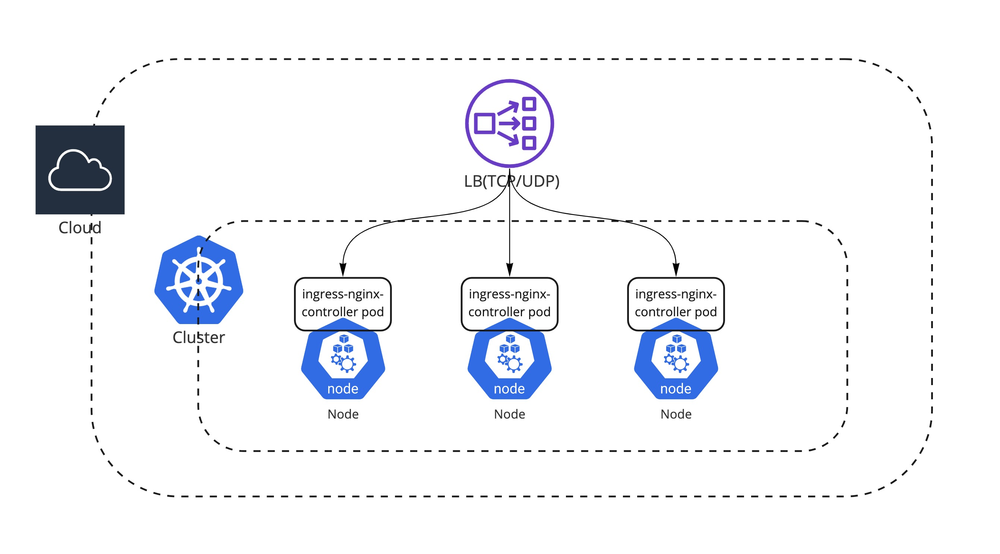
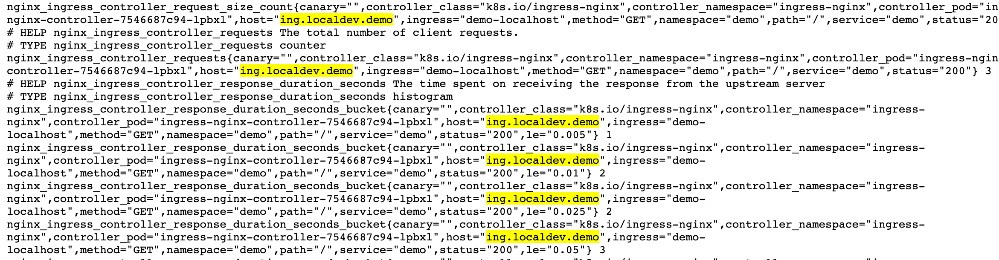

# Ingress Controller

Ingress는 아래 그림과 같이 클러스터 외부에서 클러스터 내부 서비스로 HTTP와 HTTPS 경로를 노출하고 뒷단의 Service로 라우팅시켜주는 트레픽 정책의 집합이다. Ingress Controller는 Ingress를 구현, 운영하기 위한 관리 시스템이다. 
만약 클라우드 환경에서 쿠버네티스를 쓴다면 클라우드 프로바이더가 managed 형태로 제공해주는 Ingress Controller를 써도 좋다. 예를 들면 AWS에서 기본 Ingress는 ALB로 매핑이 되며 이것은 AWS가 관리해 주는 리소스이기 때문에 간편하게 사용할 수 있다. 하지만 다양한 기능들을 커스텀 하게 사용하고 싶다거나 self managed 할 수밖에 없는 상황인 경우는 상용 혹은 오픈소스 [Ingress Controller (Additional)](https://medium.com/swlh/kubernetes-ingress-controller-overview-81abbaca19ec)를 고려해야 한다.


<div align="right">
<a id="channel-add-button" href="http://pf.kakao.com/_nxoaTs">
  
</a></div>

## Cloud Native Ingress Controller

EKS, GKE와 같은 Managed 쿠버네티스를 사용한다면 기본 Ingress Class는 AWS: Application Load Balancer, GCP: GCE L7 Load Balancer와 같은 클라우드 프로바이더가 제공하는 LB를 사용 가능하다. 
특히 클라우드에서 직접 제공하는 LB는 기술적인 성숙도가 높고, 기존 VM과도 (수동으로)연동할 수 있으며, 사용자 입장에서 별도의 관리가 필요하지 않다. 별도의 커스텀 한 Load Balancing 기능이 필요하지 않다면 제공하는 LB를 사용하는 것이 가장 효율적이다.
만약에 Managed 쿠버네티스가 아닌 퍼블릭 클라우드 환경 위에서 Kops같은 도구를 통해서 [쿠버네티스를 직접 구성](https://aws.amazon.com/blogs/compute/kubernetes-clusters-aws-kops/) 한다고 해도 [Custom Resource Definitions (CRDs)](https://aws.amazon.com/blogs/opensource/aws-service-operator-kubernetes-available/)가 제공되기 때문에 손쉽게 LB 리소스를 연동할 수 있다.


<div align="right"> 출처: AWS Blog - <a href="https://aws.amazon.com/blogs/opensource/kubernetes-ingress-aws-alb-ingress-controller/">Kubernetes Ingress with AWS ALB Ingress Controller</a></div> 


## Ingress Nginx Controller

쿠버네티스 자체는 클라우드에 종속적이지 않는 [애그노스틱](https://en.dict.naver.com/#/entry/enko/e36b56714ef5450c9cf82ef18efb1190)한 도구이기 때문에 다양한 Ingress Controller가 있다. 대표적으로 오픈소스 ingress 중에서는 [Ingress-Nginx](https://github.com/kubernetes/ingress-nginx/tree/main/charts/ingress-nginx)가 유명하며 [쿠버네티스 공식적으로 지원](https://kubernetes.io/docs/concepts/services-networking/ingress-controllers/)을 하는 컨트롤러 이다. 단 Nginx가 직접 관리하는 프로젝트가 아니라 Kubernetes 커뮤니티에서 관리를 하는 프로젝트이기 때문에 기존에 쓰던 성능 튜닝이나 Rate limit, JWT vailidation와 같은 rich한 Nginx 기능들을 그대로 설정하고 관리하기를 원한다면 공식적으로 Nginx에서 관리하는 [Nginx-Ingress](https://docs.nginx.com/nginx-ingress-controller/installation/installation-with-helm/)를 쓰는 것도 방법이다.
만약 Nginx Ingress를 사용하기로 하였다면 둘 간의 어떤 차이점이 있는지 한번 확인해 보는 것을 추천한다. 

[쿠버네티스 커뮤니티 Ingress Controller vs. NGINX Ingress Controller](https://www.nginx.com/blog/guide-to-choosing-ingress-controller-part-4-nginx-ingress-controller-options/#NGINX-vs.-Kubernetes-Community-Ingress-Controller)

## Ingress Nginx Setup

쿠버네티스 커뮤니티 Ingress Controller를 셋업하고 모니터링 metrics를 활성화하는 방안을 소개한다.

### Prerequisites
- [Helm3](https://helm.sh/)
- EKS, GKE와 같은 Cloud Kubernetes Cluster 혹은 [MiniKube](https://minikube.sigs.k8s.io/docs/start/)

### Install Ingress-Nginx

설정값은 다음 [repo](https://github.com/kubernetes/ingress-nginx/blob/main/charts/ingress-nginx/values.yaml)에서 확인할 수 있으며 설치는 기본 설정값으로 진행한다. (추후 변경 예정)
```
helm repo add ingress-nginx https://kubernetes.github.io/ingress-nginx
helm repo update

helm upgrade --install ingress-nginx ingress-nginx \
  --repo https://kubernetes.github.io/ingress-nginx \
  --namespace ingress-nginx --create-namespace
```


만약 Public cloud 환경에서 ingress-nginx를 구성하였다면 ingress-nginx의 서비스의 [type: LoadBalancer](https://github.com/kubernetes/ingress-nginx/blob/main/charts/ingress-nginx/values.yaml#L502)이 기본 이므로 L4 level(TCP/UDP) LoadBalancer가 ingress-nginx Pod 앞단에 구성된 것을 확인할 수 있다.

예상 output - EKS

```
kubectl get svc -n ingress-nginx
NAME                                         TYPE           CLUSTER-IP      EXTERNAL-IP                                                                    PORT(S)                      AGE
service/ingress-nginx-controller             LoadBalancer   10.100.193.33   a6764e85cc5404c079112dbb75a60078-1098452773.ap-northeast-2.elb.amazonaws.com   80:30446/TCP,443:31287/TCP   38s
```

AWS EKS의 ingress-controller 구성


!!! INFO
    Minikube의 경우는 실제 LoadBalancer 리소스가 없으므로 EXTERNAL-IP 가 확인 되지 않는다

### Deploy Sample App

```
kubectl create ns demo
kubectl create deployment demo --image=cloudacode/hello-go-app:v1.0.0 --port=8080 -n demo
kubectl expose deployment demo -n demo

kubectl create ingress demo-localhost --class=nginx \
  --rule="ing.localdev.demo/*=demo:8080" -n demo
```

### Verify ingress rule

브라우져에서 ing.localdev.demo:8080 접속하여 원하는 결과가 나타나는지 확인

예상 output
```
Hello, world!
Version: 1.0.0
Hostname: demo-7fbd87c6b9-qd6qt
```

!!!INFO
    cloud 환경: 테스트를 진행 하는 경우 kubectl get ingress 했을때 나오는 EXTERNAL-IP의 IP 주소를 hosts 파일 마지막 줄에 임시 추가

    ```
    External-IP's IP  ing.localdev.demo #ingress test
    ```
    ---
    minikube 환경: local 테스트를 위해 hosts 파일 마지막 줄에 다음을 추가.
    
    ```
    127.0.0.1  ing.localdev.demo #ingress test
    ```

!!!TIP
    hosts 파일은 linux, mac인 경우 /etc/hosts, 윈도우 os인 경우 C:\Windows\System32\drivers\etc\hosts

Minikube로 진행 하는 경우 다음과 같이 port-forwarding으로 local에서 ingress-nginx-controller에 연결 필요
```
kubectl port-forward --namespace=ingress-nginx \
  service/ingress-nginx-controller 8080:80
```


### Enable Metric

Prometheus 모니터링 연동을 위해 Ingress Nginx 에서 metric을 enable

helm 설정 파일(values.yaml) 
```
controller:
  metrics:
    enabled: true
    service:
      annotations:
        prometheus.io/scrape: "true"
        prometheus.io/port: "10254"
```

```
helm upgrade --install ingress-nginx ingress-nginx \
  --repo https://kubernetes.github.io/ingress-nginx \
  --namespace ingress-nginx --create-namespace -f values.yaml
```

ingress nginx controller metric endpoint가 생성 되었는지 확인
```
kubectl get svc ingress-nginx-controller-metrics -n ingress-nginx

kubectl port-forward --namespace=ingress-nginx \
  service/ingress-nginx-controller-metrics 10254
```

브라우져에서 새로운 탭으로 http://127.0.0.1:10254/metrics 에 접속하여 ingress-nginx에서 모니터링 metrics를 수집하고 있는지 검증

위에서 port-forwarding으로 접속한 http://ing.localdev.demo:8080 을 여러 번 호출 후 metrics 항목에 해당 endpoint의 수집된 metrics 추가가 되었는지 확인



## Wrap up

이 글에서는 쿠버네티스 커뮤니티에서 공식 지원하는 Ingress-Nginx를 알아 보았으며 추후 모니터링을 위해 metrics 까지 활성화 시켜보았다. 
Ingress Controller는 서비스 워크로드의 트레픽을 받는 가장 첫 번째 구성요소이며 다양한 솔루션들이 있으므로 시간을 두고 특성에 맞는 Ingress Controller를 도입 검토해야 한다. Ingress-Nginx는 하나의 controller에 하나의 domain만 지원하기 때문에 만약에 여러 domain을 하나의 ingress에서 처리해야 하는 필요가 있는 경우는 Istio같은 Ingress controller를 대체 할 수 있는 도구를 검토해 볼 필요가 있다.

<div>
<a id="channel-add-button" href="http://pf.kakao.com/_nxoaTs">
  
</a>
<a class="github-button" href="https://github.com/cloudacode/hello-kubernetes" data-icon="octicon-star" data-size="large" data-show-count="true" aria-label="Star cloudacode/tutorials on GitHub">Star</a>
</div>

<script async defer src="https://buttons.github.io/buttons.js"></script>

이 글이 유용하였다면 ⭐ Star를, 💬 1:1 질문이나 기술 관련 문의가 필요하신 분들은 클라우드어코드 카카오톡 채널 추가 부탁드립니다.🤗