# Kubernetes Essential Component

쿠버네티스를 효율적으로 사용하기 위해서는 필수 쿠버네티스 관리 컴포넌트들을 이해하고 구성할 필요가 있다.

## Kubernetes Components 란?

쿠버네티스를 구성 후 곧바로 쿠버네티스를 쓸 수 있는 것은 아니다. 예를 들면 리눅스 구성 후에 user를 만들고 ldap을 연동하고 애플리케이션에 맞는 다양한 runtime을 설치하고 모니터링을 연동해야 하는 것처럼 쿠버네티스 구성 후에 그 위에 다양한 k8s components를 구성해야 한다.

CNCF(Cloud Native Cloud Foundation)에서 다양한 소프트웨어들을 sandboxing, inclubating하고 graduating 시키고 있으며 다양한 도구들, 서비스들이 생김에 따라 쿠버네티스 생태계가 엄청나게 발전하고 매 순간 진화되고 있다. 아래는 2022년 현재(1월) CNCF Landscape 생태계 모습이다.

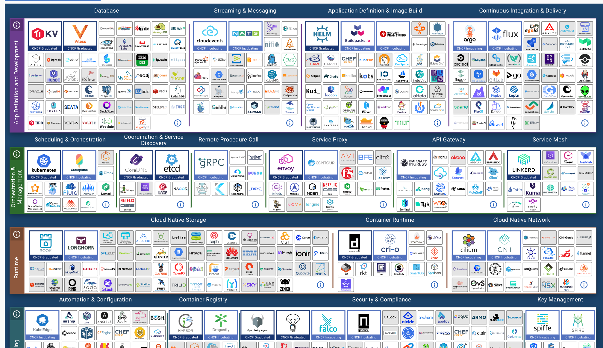
출처: [CNCF Landscape](https://landscape.cncf.io/)

Kubernetes를 비롯해 유명한 도구 혹은 컴포넌트들로는 패키징 관리 Helm, CI/CD 도구인 ArgoCD, 트레픽 관리 도구인 Istio, 서비스 프록시 Envoy들이 CNCF 생태계 안에서 계속 코드를 기여하고 발전 중이다. 수많은 서비스가 계속 이곳 안에서 생겨나고 있으며 트랜드를 따라가기 위해 주의 깊게 보고 있어야 한다.

이제 한 가지 의문점이 생길 수 있다. 그래서 내가 "무엇을 써야 하지?" 혹은 "내가 하나씩 다 검증(PoC)해서 나에게 맞는 컴포넌트를 직접 찾아야 하는 건가?" 우선 결론 부터 말하자면 맞다 하나의 정답은 없으므로 직접 검증해보고 본인 서비스에 맞는 컴포넌트들을 찾아야한다. 그럼 그다음 질문은 "너무 많은데 어디서부터 어떻게 시작해야 하지?" 가 나올 수밖에 없을 것이다. 현업에서 일하면서 지인들에게 가장 많이 들었던 질문이기도 하고 생태계 자체가 방대하다 보니 실제로 길을 잃기 쉽다. 쿠버네티스가 어렵다고 말하는 부분 중 하나가 바로 이것이다. 

현업에서도 가장 많이 겪는 허들이고 어떻게 보면 쿠버네티스 구축 초기에 가장 많은 시간을 집중해서 해야 하는 부분이다. 이렇게 하면 된다는 마법의 구성 표준은 없으나 현업에서 실제로 구성하고 운영하면서 이런 건 필수로 있으면 좋은 컴포넌트들에 대해서 간략하게 아래에서 정리해 본다.

## Kubernetes Essential Component

다양한 도구를 검토해보고 프러덕션에 적용해 보면서 이 정도의 컴포넌트는 쿠버네티스 구성 후 Week 1에 필수로 추가해야 한다고 생각하는 목록이다.

* <a href="https://miro.com/app/board/uXjVOVByMV0=/" target="_blank">상세 그림 보드 바로가기</a>  비밀번호: 카카오톡 채널 <a href="http://pf.kakao.com/_nxoaTs">클라우드어코드</a> 에서 확인 
 
<!-- [상세 보드 링크](https://miro.com/app/board/uXjVOVByMV0=/), 비밀번호: 카카오톡 채널 [클라우드어코드](http://pf.kakao.com/_nxoaTs) 에서 확인 -->

### 인그래스 컨트롤러

Ingress는 아래 그림과 같이 클러스터 외부에서 클러스터 내부 서비스로 HTTP와 HTTPS 경로를 노출하고 뒷단의 Service로 라우팅시켜주는 역할을 한다.
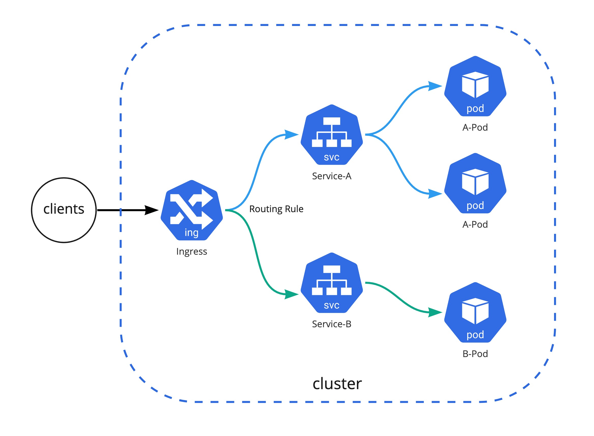

만약 클라우드 환경에서 쿠버네티스를 쓴다면 클라우드 프로바이더가 managed 형태로 제공해주는 인그래스 컨트롤러를 써도 좋다. 예를 들면 AWS에서 기본 Ingress는 ALB로 매핑이 되며 이것은 AWS가 관리해 주는 리소스이기 때문에 간편하게 사용 할 수 있다. 하지만 다양한 기능들을 커스텀하게 사용하고 싶다거나 self managed 할 수밖에 없는 상황인 경우는 오픈소스 Ingress Controller를 고려해야 한다. 
[Ingress-Nginx](https://github.com/kubernetes/ingress-nginx/tree/main/charts/ingress-nginx)가 가장 대표적이며 신뢰 할수 있는 솔루션이다. 성능 튜닝이나 Rate limit, JWT vailidation을 Proxy(혹은 LB 레벨)에서 하기를 원한다면 공식적으로 Nginx에서 제공하는 [Nginx-Ingress](https://docs.nginx.com/nginx-ingress-controller/installation/installation-with-helm/)를 써도 좋다. 오래된 글이지만 다양한 Ingress Controller에 대해 비교한 [medium 블로그](https://medium.com/swlh/kubernetes-ingress-controller-overview-81abbaca19ec)도 읽어 보는 것을 추천한다.

### DNS 관리

쿠버네티스 ingress 혹은 service를 통해 외부로 서비스를 노출 시켰다면 그 LB Endpoint 이름(혹은 IP) 레코드를 DNS ZONE에 누군가는 등록시켜줘야 한다. 예를 들면 EKS에서 Ingress를 생성하면 ALB endpoint가 내 External-IP로 매핑이 되는데 이 External-IP를 내 도메인 DNS에 원하는 Subdomain으로 사용하려면 직접 Route53에 추가해 줘야 한다. 매번 서비스가 올라올 때 마다 수동으로 등록하는 것은 효율적이지 못하기에 이것을 [External-DNS](https://github.com/kubernetes-sigs/external-dns)로 자동화 시켜야 할 필요가 있다.
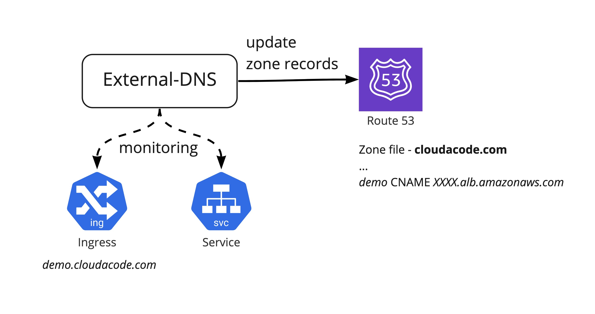

### 인증서 관리

애플리케이션을 외부로 노출 시켰다면 HTTPS 통신을 위해 LB에서 SSL termination을 시키도록 세팅 해줘야 한다. AWS, GCP와 같은 일반적인 클라우드 환경에서는 클라우드 LB에 SSL 인증서를 직접 임포트 하고 관리 할 수 있지만, 매번 인증서 갱신 일정에 맞춰서 수동으로 해줘야 상황이 발생한다. 물론 이 프로세스를 자동화할 수는 있으나 인증 기관(Certificate Authority e.g. DigiCert, Comodo등)에 API 연동을 지원하지 않는 경우가 많다. 쿠버네티스 환경에서 매번 전통적인 방식으로 인증서를 발급(issue), 갱신(re-issue)하고 수동으로 TLS를 Secrets으로 넣는 것은 매우 비효율적이다. 이 프로세스를 자동화하기 위해 [Cert-Manager](https://github.com/jetstack/cert-manager)를 활용할 수 있으며 Cert-Manager는 개방형 인증 기관인 [Let's Encrypt](https://letsencrypt.org/)에 매번 인증서 갱신 기간에 맞춰서 인증서를 재갱신 시키면서 Secerts에 TLS key를 업데이트 자동으로 해주기 때문에 인증서 만료에 대한 걱정을 할 필요가 없다.
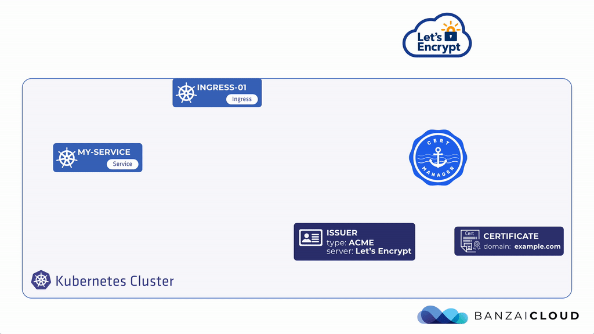

 출처: Banzai Cloud - <a href="https://banzaicloud.com/blog/cert-management-on-kubernetes/">Cert management on kubernetes</a>
 

### Continuos Delivery

모든 리소스가 쿠버네티스를 통해서 정의하고 declarative(선언형)하게 배포 및 관리를 할 수 있게 됨에 따라 GitOps 워크플로우가 대세가 되고 있다. 대표적으로 [ArgoCD](https://argo-cd.readthedocs.io/en/stable/)와 [FluxCD](https://github.com/fluxcd/flux2)가 GitOps 전략으로 리소스를 배포하고 업데이트 할 수 있도록 해주는 워크플로우 관리 및 CD(Continuous Delivery)컴포넌트이다. 아래 그림은 Pull Based로 배포 하는 GitOps 전략 방법이다. 팀 혹은 프로젝트별로 효과적인 Flow가 각각 다르므로 배포 전략에 대해 충분히 토론한 후 ArgoCD 혹은 FluxCD를 도입하는 것을 추천한다.

 출처: <a href="https://www.gitops.tech/#pull-based-deployments">GitOps tech blog</a>
 
쿠버네티스 리소스를 kustomize 혹은 helm으로 구성하는 경우는 FluxCD가 보다 native 하게 쓸 수 있다는 장점이 있으나 WebUI가 존재하지 않아 여러 사용자를 수용해야하는 Multi-tenecy Cluster 일 경우는 ArgoCD가 사용자 친화적인 CLI, UI가 있어서 보다 적합 할 수 있다.

### 트레픽 관리 및 서비스 매쉬

Ingress로 외부에서 들어오는 트레픽에 대한 제어를 하였다면 클러스터 내부적으로 트레픽의 흐름 및 제어가 필요한 경우가 발생한다. 마이크로서비스 앱과 같이 다양한 백엔드 서비스들이 서로 유연하게 통신하고 심리스 하게 Failover가 되어야 하는 경우 트레픽을 세세하게 제어(Fine-grained control)이 필요하기도 하다. 예를 들면 [Istio](https://istio.io/)를 통해서 커스텀 한 라우팅 규칙이나 Rate Limit과 같은 정책들을 추가 할 수 있으며 모든 클러스터에 Ingress/Engress 트레픽을 모니터링 및 추적 할 수 있다. 이런 기능을 구현하기 위해 애플리케이션에 전통적인 방식으로 별도의 코드를 추가하는 것이 아니라 [Linkerd](https://github.com/linkerd/linkerd2) 혹은 [Envoy Proxy](https://www.envoyproxy.io/docs/envoy/latest/intro/what_is_envoy) 같은 서비스 매쉬를 통해서 Sidecar 방식으로 각 Pod에 proxy가 추가되어 각 서비스 간 연관 관계를 파악하고 모니터링한다.
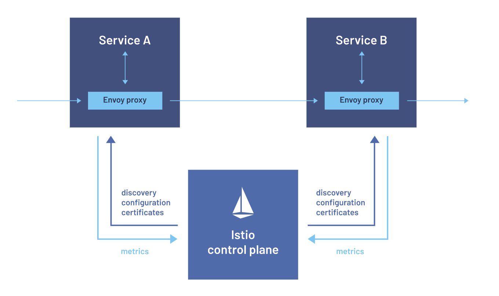

### 백업 관리

쿠버네티스가 cloud agnostic 하다는 장점이 있지만 반대로 그만큼 추상화된 영역이 많다 보니 어디서 어떤 것을 어떻게 백업해야 하는지 알기 어려운 부분이 있다. Stateless 한 서비스들 같은 경우는 GitOps 워크플로우가 잘 정립되어 있다면 바로 ArgoCD, FluxCD로 다시 배포하면 되기 때문에 백업에 관해 신경쓰지 않아도 되지만 DB나 [Vault](https://www.vaultproject.io/) 같은 State가 중요한 서비스들은 PersistentVolume에 State를 저장하고 데이터를 주기적으로 백업을 해야 한다. VMWare(이전 Pivotal)에서 오픈소스화한 [Velero](https://velero.io/)가 현재까지는 가장 손쉽게 백업하고 리소스들을 복원할 수 있는 컴포넌트이다. 당연하겠지만 인프라, 쿠버네티스 레이어의 백업이기 때문에 애플리케이션 레벨의 데이터 백업은 추가로 각자 고민해야 하는 부분이다.
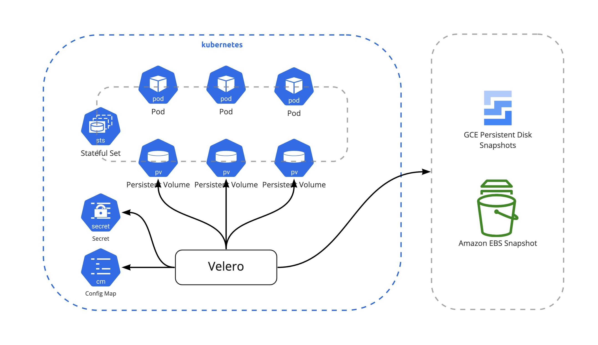

### 정책 관리

모든 쿠버네티스의 [API 오브젝트](https://kubernetes.io/docs/concepts/overview/working-with-objects/kubernetes-objects/)들을 수동으로 확인하고 관리하는 것은 매우 힘든 일이다. 특히나 사용자들이 허용하기로 혹은 하지 않기로 한 쿠버네티스 정책을 인지하지 못한 상태에서 리소스들을 원하는 설정으로 배포하다 보면 추후 운영 시 어려움이 발생 할 수 있다. 예를 들면 개발팀이 실수로 회사에서 정한 environment label을 넣지 않고 배포한다면 추후에 label로 prometheus, loki에서 모니터링 대상으로 추가시킬 수 없다. 물론 수동으로 다시 추가하면 되는 부분이나 이런 시간 소모적인 운영 업무를 최소화하기 위해서는 배포 혹은 API 요청 단계부터 제한을 시키는 방법이 있다. [GateKeeper](https://github.com/open-policy-agent/gatekeeper) 나 [Kyverno](https://kyverno.io/)가 Policy에 대해서 배포 하기 전에 사전 검증(Validation)하고 필요에 따라서는 정책에 맞도록 변조(Mutation)하고 모니터링 및 레포팅 가능하다. 주요한 기능(Validation, Mutation, Montoring)은 대부분 비슷하고 GateKeeper는 쿠버네티스 뿐만이 아니라 다양한 정책을 검증 가능한 장점이 있지만 별도의 문법을 배워야 한다는 단점이 있다. Kyverno는 쿠버네티스 yaml 형태로 작성이 되기 때문에 빠르게 도입 가능하다는 장점이 있다.
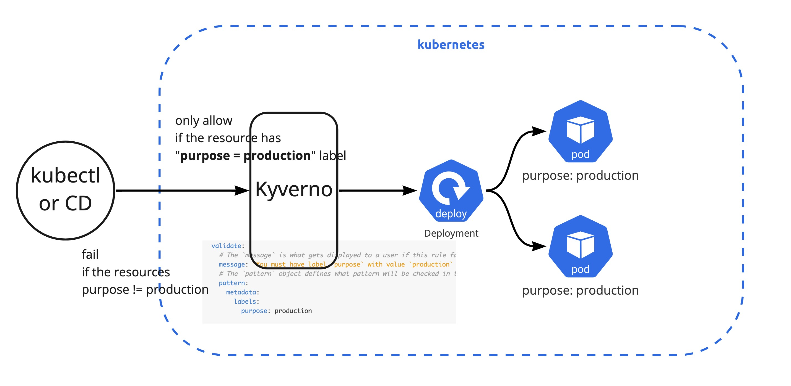

### 모니터링

쿠버네티스 환경과 같은 분산형 시스템 환경에서는 리소스를 서버 이름 혹은 IP로 기준으로 관리하는 전통적인 모니터링 방법보다는 tag 혹은 label 기반으로 서비스의 전체 사용량, 가용량과 같은 클러스터 관점의 모니터링하는 것이 더욱 적합하다.  

특히 쿠버네티스에서는 다음과 같은 4가지 항목의 관점에서 모니터링이 필요하다.

* Metric: 사용량(Utilization), 포화도(Saturation), 애러(Error), 가용량(Availability) 등
* Event: 릴리즈 버전(Release version), 현재 버전의 가동 시간(Uptime for current version), 확장 이벤트(Scaling event) 등
* Log: 애플리케이션 로그(Application log), 쿠버네티스 로그(Kubernetes log) 등
* K8S Resource: 클러스터 용량(Cluster capacity), 네임스페이스 리소스 용량(Namespace resource) 등

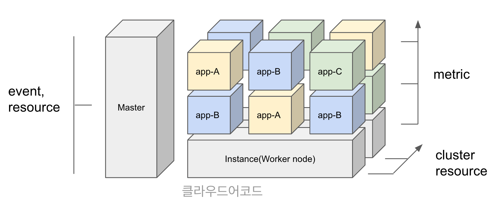

**모니터링(시스템)**: 시스템 메트릭 같은 경우는 대부분 시계열(time series) 데이터이기 때문에 [확장성의 제한](https://news.ycombinator.com/item?id=2744463)이 있는 [rrdtool](https://github.com/oetiker/rrdtool-1.x?ref=stackshare)과 같은 방식 보다는 NoSql 혹은 시계열 데이터에 최적화된 [Prometheus](https://prometheus.io/), [InfluxDB](https://github.com/influxdata/influxdb), 혹은 [TSDB](https://github.com/OpenTSDB/opentsdb) 같은 time series database를 쓰는 것이 효과적이다. 이 중에서도 Prometheus가 마이크로서비스드 환경에서 동적으로 데이터를 [exporter](https://prometheus.io/docs/instrumenting/exporters/)들을 통해 수집할 수 있고 커스텀하게 추가 개발 가능하며 [다차원의 쿼리](https://prometheus.io/docs/prometheus/2.32/querying/basics/)를 지원한다. 또한 [AlertManager](https://github.com/prometheus/alertmanager)와 네이티브 하게 연결되어 슬렉과 같은 메시징 플랫폼 혹은 [PagerDuty](https://www.pagerduty.com/)와 같은 incidient management 도구들과도 손쉽게 연동할 수 있다.

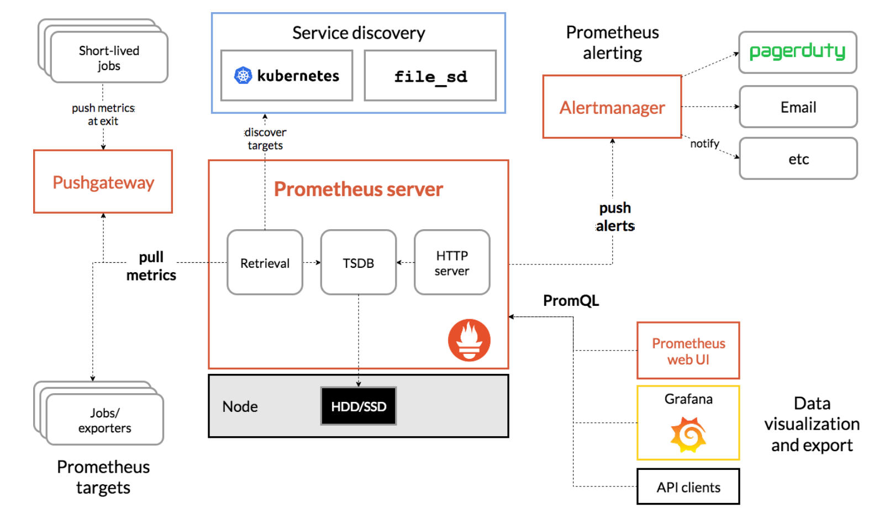

 출처: <a href="https://prometheus.io/docs/introduction/overview/">prometheus.io</a>
 

**모니터링(로그)**: 분산형 환경에서는 서버에 각각 접속해 로그를 본다는 것이 매우 시간 소모적인 작업이므로 중앙집중형 로그 시스템은 필수적인 항목이다. 특히 로그를 STDOUT 혹은 STDERR로 쓰는 것이 일반적인 패턴인 쿠버네티스 환경의 경우 로그가 node 로컬에 저장이 되고 label 셀렉터를 통해 필요할 때 수집 할 수 있지만 node나 pod가 죽는 경우를 대비하여 log stream으로 실시간(혹은 준실시간)으로 로그를 전송 해야 한다. 

만약 로그 검색을 full-text search로 하고 그것 결과를 각종 차트로 만들어야 하는 경우가 아니라면 ElasticSearch 보다는 과감하게 시계열 기반으로 로그를 저장하고 label만 indexing을 하는 [Loki](https://github.com/grafana/loki)로 가는 것을 추천한다. 쉽게 말하면 특정 기간동안 특정 이름으로 시작하는 앱 서버 전체 중 특정 애러 패턴에 대해 top ranking을 매기는 로그 검색과 차트를 만들어야 하는 것이 아니라, production 와 web의 label을 갖는 서버들의 에러 중에 403이 있는 서버의 1분 동안 로그를 확인하는 것만으로도 충분하다면 Loki가 보다 서버 및 운영 측면에서 ELK 스택보다 리소스도 덜 들며 비용 효율적이다. 또한 Prometheus like한 컨셉과 쿼리 패턴을 갖고 있기 때문에 Prometheus로 시스템 메트릭 모니터링을 하고 있다면 빠르게 Loki를 적응 할 수 있다. 

물론 퍼블릭 클라우드 위에서 Managed Kubernetes Cluster를 사용하고 있다면 이미 [CloudWatch](https://docs.aws.amazon.com/ko_kr/AmazonCloudWatch/latest/monitoring/Container-Insights-setup-logs-FluentBit.html), [StackDriver](https://cloud.google.com/stackdriver/docs/solutions/gke/managing-logs)에서 손쉽게 로그를 수집, 쿼리 할 수 있기 때문에 제공하는 기본 Log 모니터링 솔루션을 쓰는 것도 좋은 방법이다. 

<iframe width="560" height="315" src="https://www.youtube.com/embed/CQiawXlgabQ" title="YouTube video player" frameborder="0" allow="accelerometer; autoplay; clipboard-write; encrypted-media; gyroscope; picture-in-picture" allowfullscreen></iframe>

**모니터링(대시보드)**: 대시보드는 말할 것이 없다. 모든 모니터링(시스템, 로그, APM)을 비용 걱정 없이 [Datadog](https://www.datadoghq.com/solutions/kubernetes/) 쓰는 상황이 아니라면 [Grafana](https://github.com/grafana/helm-charts) 가자. 만약에 기존에 Telegraf로 수집하고 InfluxDB, Kapacitor를 사용 중이라면 [Chronograf](https://github.com/influxdata/chronograf)로 대체 할 수 있으나 [Grafana](https://github.com/grafana/grafana)가 커뮤니티 크기나 github star 개수만 비교하더라도 비교 할 수 없을 정도로 높다(대세이다).

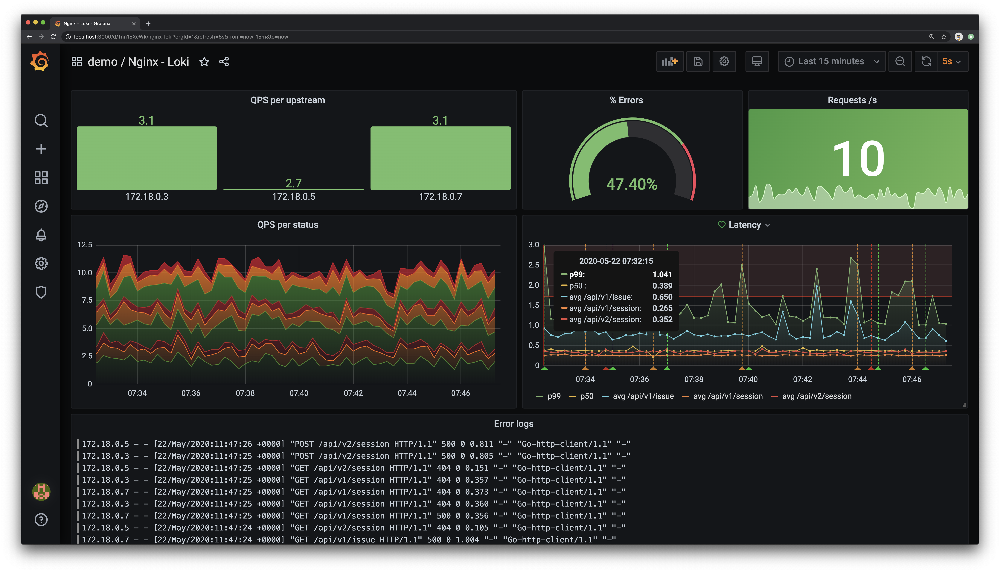

### Tracing

서비스간 연관관계가 복잡하게 연결되어 있는 마이크로서비스드 환경에서는 특히나 서비스들 끼리의 트레픽을 추척하여 안정성 혹은 성능 개선을 위한 정확한 지점을 찾는 것도 매우 중요하다. 대표적으로 [Jaeger](https://github.com/jaegertracing/jaeger)와 [ZipKin](https://github.com/openzipkin/zipkin/)이 있으며 기능상으로는 대동소이 하나 Jager가 [OpenTracing](https://opentracing.io/specification/) 기능을 네이티브 하게 지원하고 있으며 쿠버네티스가 있는 CNCF 커뮤니티에서 성공적으로 Graduated 한 대표적인 프로젝트이다.

 출처: <a href="https://eng.uber.com/distributed-tracing/">Evolving Distributed Tracing at Uber</a>
 

### Local Development

쿠버네티스 환경에서 아무리 CICD 환경이 잘되어 있고 블루그린 배포 전략 그리고 모니터링 환경이 잘되어 있다고 하더라도 문제가 발생했을 때 빠르게 디버깅을 내 로컬 환경에서 하고 싶은 경우가 발생할 것이다. 물론 port-fowarding을 통해서 해당 Pod로 들어가서 하는 방법도 있지만 나의 로컬 환경에서 실제 트레픽을 받아서 디버깅하고 싶거나 혹은 배포 하기 전에 간단히 Production에서 Pod 하나만 테스트 해보고 싶다면 [Telepresence](https://github.com/telepresenceio/telepresence)를 활용하면 된다. Proxy 역할을 해주는 telepresence traffic-agent 컨테이너가 sidecar 패턴으로 Pod에 추가되어 요청에 따라 traffic을 intercept 하여 traffic-manager에게 전달하고 내 로컬에 있는 telepresence daemon을 통해 로컬 app으로 트레픽을 포워딩시켜준다.

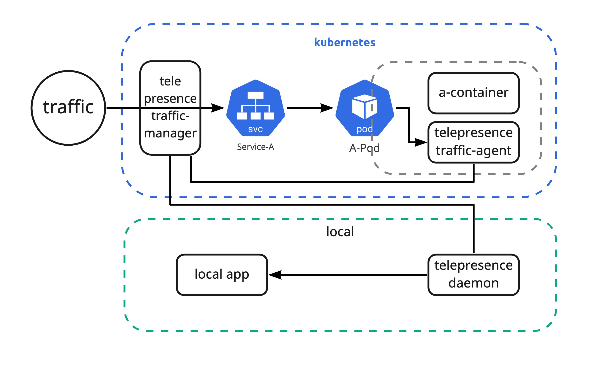

### 패키지 및 설정 관리

쿠버네티스에서 애플리케이션을 배포하기 위해 몇가지의 방법이 있다. 기본적으로 kubectl manifest로 나의 애플리케이션에 대한 구성정보를 yaml형태(manifest)로 만들게 된다. 하지만 구성정보가 복잡해질수록 매번 kubectl apply 명령어를 수행하는 것 자체가 시간 소모적인 작업이며 사람의 실수로 특정 리소스가 제외되고 배포되기도 한다. 특히나 똑같은 애플리케이션을 하나의 환경이 아닌 여러 환경에 설정만 바꿔서 배포하는 경우 중복되는 코드가 매우 늘어나게 된다. 

재사용성을 높이고자 **패키지 관리 도구 혹은 템플릿 도구**인 [Helm](https://helm.sh/)이 나오게 되고 patch와 같이 특정 환경에만 적용되어야 하는 추가적인 manifest 대해 효과적으로 관리하기 위해 **설정 관리** 도구인 [Kustomize](https://kustomize.io/)가 등장하게 된다. Helm과 Kustomize가 서로 대체하는 솔루션으로 생각 할 수도 있지만 helm에서는 애플리케이션의 템플릿 팀만 하고(chart로만 만들고) Kustomize에서 helm chart를 overlaying 할 수 있기 때문에 helm 자체도 kustomize로 유연하게 배포 관리할 수 있다. 

## 마지막으로

AWS Solution Architect 처럼 CNCF Landscape의 솔루션들을 Architecting 해주고 on-boarding도 시켜주는 사람이 있으면 좋겠으나 아쉽게도 그런 사람은 존재하지 않는다. (실제로는 있으나 내 주위에 없다!) 쿠버네티스 컨설팅 파트너라는 회사들이 생겨 나고 있으나 어느정도 역량을 보유하고 있는지는 표면상으로 확인 하기 어렵다. [Jetstack](https://www.jetstack.io/)이나 [WeaveWorks](https://www.weave.works/) 처럼 본인들의 솔루션을 계속 CNCF에 기여 하면서 컨설팅을 하는 회사가 그나마 역량이 있는 곳이라고 볼수 있다. 

항상 강조하는 것이지만 현재 트랜드인 도구만 도입한다고 끝이 아니며 서비스를 사용하는 사용자(stakeholder)들에게 요구사항 조사를 주기적으로 해서 시스템을 고도화시켜야 한다. 또한 같이 개발, 운영해 나가는 동료(placeholder)들과 정기적으로 시스템을 개선하고 함께 레벨업 해야지만 안정적으로 모던 인프라스트럭쳐를 발전시켜나갈 수 있을 것이다.